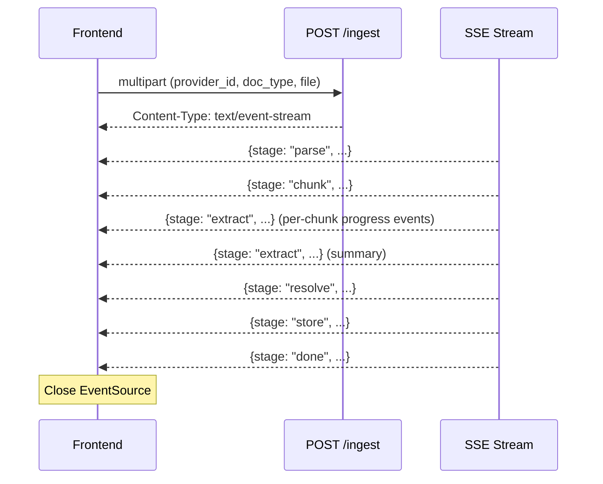
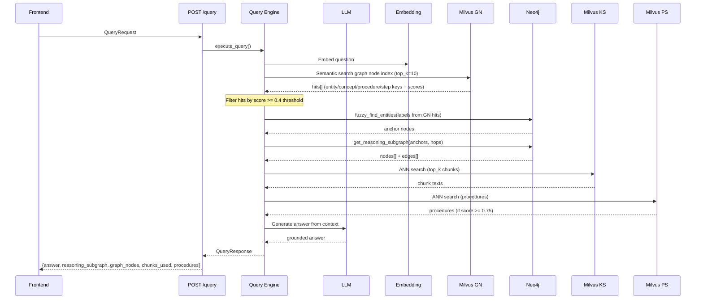

# API Reference

Base URL: `http://localhost:8000` (backend) or `http://localhost:5173/api` (via frontend proxy)

## Health

### `GET /health`

Check connectivity to all stores.

**Response:**
```json
{
  "status": "ok",
  "stores": {
    "neo4j": { "connected": true },
    "milvus": { "connected": true, "collections": ["ks_circuit_intelligence", "ps_circuit_intelligence", "gn_circuit_intelligence"] }
  }
}
```

## Providers

### `GET /providers`

List all context providers.

**Response:** `ContextProvider[]`

### `POST /providers`

Create a new context provider.

**Body:**
```json
{
  "provider_id": "circuit-intelligence",
  "name": "Circuit Intelligence",
  "description": "Telecom circuit data and SOPs"
}
```

**Response:** `ContextProvider` (201)

### `GET /providers/{provider_id}`

Get a single provider's metadata.

### `DELETE /providers/{provider_id}`

Delete a provider and wipe all associated data from all four stores (Neo4j, KS, PS, GN).

**Response:**
```json
{ "deleted": true, "graph_nodes_removed": 42 }
```

### `GET /providers/{provider_id}/nodes`

Browse graph nodes for a provider.

**Query params:** `label` (optional filter), `limit` (default 50)

**Response:** `GraphNode[]`

### `GET /providers/{provider_id}/stats`

Get node/edge/chunk counts for a provider.

**Response:**
```json
{ "nodes": 42, "chunks": 24, "entities": 15, "concepts": 3, "propositions": 8, "procedures": 1 }
```

### `GET /providers/{provider_id}/graph`

Return the full graph (nodes + edges) for the Graph Explorer.

**Query params:** `limit` (default 300, caps node count; edge limit is 3x node limit)

**Response:**
```json
{
  "nodes": [
    { "id": "4:abc:123", "label": "Entity", "properties": { "label": "CID-44821", "entity_type": "Circuit" } },
    { "id": "4:abc:456", "label": "Step", "properties": { "step_number": 1, "description": "..." } }
  ],
  "edges": [
    { "source": "4:abc:123", "target": "4:abc:456", "type": "REFERENCES" },
    { "source": "4:abc:789", "target": "4:abc:456", "type": "PRECEDES" }
  ]
}
```

### `GET /providers/{provider_id}/graph/{node_id}`

Return a single node with its direct neighbours and connecting edges.

**Response:**
```json
{
  "id": "4:abc:123",
  "label": "Entity",
  "properties": { "label": "CID-44821", "entity_type": "Circuit", "description": "..." },
  "neighbours": [
    {
      "neighbour_id": "4:abc:456",
      "neighbour_label": "Chunk",
      "neighbour_props": { "chunk_id": "...", "source_file": "contract.pdf" },
      "edge_type": "MENTIONS",
      "direction": "in"
    }
  ]
}
```

## Ingest

### `POST /ingest`

Upload a document for ingestion. Returns an SSE stream of pipeline events.

**Content-Type:** `multipart/form-data`

| Field | Type | Required | Description |
|-------|------|----------|-------------|
| `provider_id` | string | yes | Target provider |
| `doc_type` | string | yes | `pdf`, `text`, `csv`, `sop`, `ddl` |
| `file` | file | yes | Document to ingest |

**Response:** `text/event-stream` — Server-Sent Events

```
data: {"stage":"parse","message":"Parsed contract.pdf (pdf, 12 pages)","detail":{...}}
data: {"stage":"chunk","message":"Created 24 chunks","detail":{"count":24}}
data: {"stage":"extract","message":"Extracting chunk 1/24...","detail":{"chunk_index":0,"total":24,"progress":true}}
data: {"stage":"extract","message":"Extracted 15 entities...","detail":{...}}
data: {"stage":"resolve","message":"Resolved 15 entities, 12 new, 3 merged","detail":{...}}
data: {"stage":"store","message":"Stored 42 nodes, 38 edges, 24 chunks","detail":{...}}
data: {"stage":"done","message":"Ingestion complete","detail":null}
```



## Query

### `POST /query`

Ask a question grounded in the provider's knowledge.

**Body:**
```json
{
  "provider_id": "circuit-intelligence",
  "question": "What is the decommission procedure for a circuit?",
  "top_k": 5,
  "graph_hops": 2
}
```

**Response:**
```json
{
  "answer": "The decommission procedure involves...",
  "reasoning_subgraph": {
    "nodes": [
      { "node_id": "4:abc:123", "label": "Procedure", "properties": { "name": "Circuit Decommission", "intent": "..." }, "relevance": null },
      { "node_id": "4:abc:456", "label": "Step", "properties": { "step_number": 1, "description": "..." }, "relevance": null }
    ],
    "edges": [
      { "source": "4:abc:123", "target": "4:abc:456", "edge_type": "HAS_STEP" },
      { "source": "4:abc:456", "target": "4:abc:789", "edge_type": "PRECEDES" }
    ],
    "anchor_node_ids": ["4:abc:123"]
  },
  "graph_nodes": [
    { "node_id": "4:abc:123", "label": "Procedure", "properties": { "name": "Circuit Decommission", "intent": "..." }, "relevance": null }
  ],
  "chunks_used": ["chunk-id-1", "chunk-id-2"],
  "procedures": ["Circuit Decommission"],
  "provider_id": "circuit-intelligence"
}
```

### Query Flow


