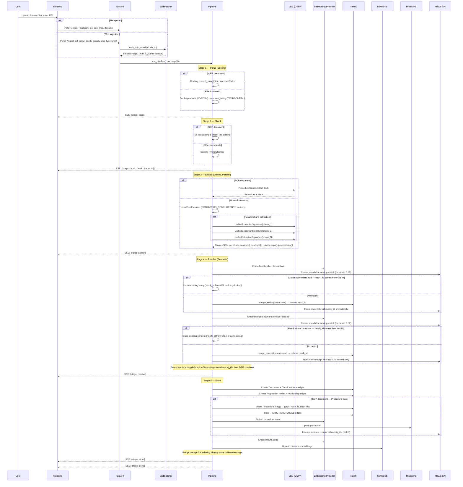
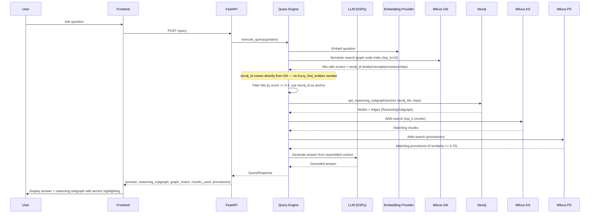
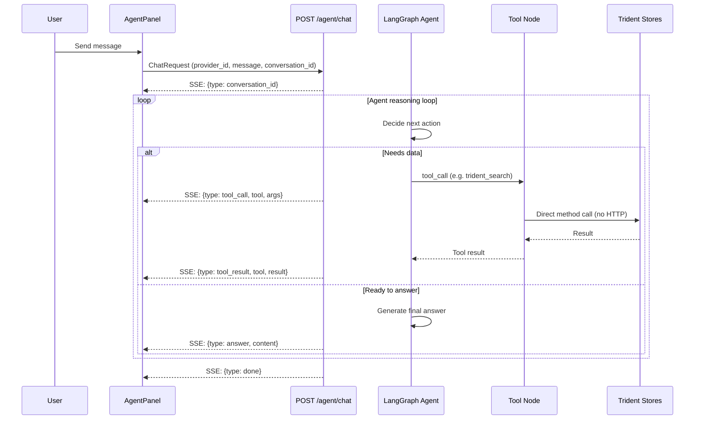

# Trident Architecture Overview

## System Overview

Trident is a context substrate layer that ingests documents (files and web pages), extracts structured knowledge, and vends answers grounded in four complementary stores. It includes a LangGraph-based agent with composable tools for interactive exploration.

```
┌──────────────┐     ┌──────────────────────────────────────────────────┐
│   Frontend   │     │                    Backend                       │
│  React/Vite  │────▶│          FastAPI + DSPy + LangGraph Agent        │
│  :5173       │     │                    :8000                         │
└──────────────┘     └────┬──────────┬──────────┬──────────┬────────────┘
                          │          │          │          │
                          ▼          ▼          ▼          ▼
                   ┌──────────┐ ┌──────────┐ ┌──────────┐ ┌──────────┐
                   │  Neo4j   │ │ Milvus   │ │ Milvus   │ │  OpenAI  │
                   │ Concept  │ │ KS + PS  │ │ GN Index │ │ Embed +  │
                   │ Graph    │ │ Vectors  │ │ (neo4j_id│ │ LLM      │
                   │ :7687    │ │ :19530   │ │  linkage)│ │(external)│
                   └──────────┘ └──────────┘ └──────────┘ └──────────┘
```

## The Four Stores

| Store | Technology | Purpose | Collection Pattern |
|-------|-----------|---------|-------------------|
| **Concept Graph** | Neo4j | Entities, concepts, relationships, propositions, procedure DAGs | Nodes scoped by `provider_id` property |
| **Knowledge Store (KS)** | Milvus | Document chunk embeddings for semantic search | `ks_{provider_id}` collection per provider |
| **Procedural Store (PS)** | Milvus | Procedure intent embeddings for SOP retrieval | `ps_{provider_id}` collection per provider |
| **Graph Node Index (GN)** | Milvus | Embedding signatures for all nodes with `neo4j_id` — serves dual purpose: deduplication during ingestion (semantic resolution) + anchor search during query. Each GN entry stores the Neo4j element ID, creating a direct vector-to-graph link with no fuzzy lookup needed. | `gn_{provider_id}` collection per provider |

## Data Flow — Ingestion



## Data Flow — Query



## LangGraph Agent

Trident includes a LangGraph-based conversational agent (`backend/agent/`) that uses composable tools to interactively explore and modify the knowledge graph. The agent runs as a `StateGraph` with an agent-to-tools loop.

### Architecture

```
backend/agent/
├── tools.py     — 9 tools (6 read + 3 write) wrapping Trident stores directly
├── graph.py     — LangGraph StateGraph: agent → tools → agent loop
├── memory.py    — In-memory conversation store with sliding window (default 20 messages)
└── (routers/agent.py) — POST /agent/chat (SSE), DELETE/GET /agent/conversations
```

### Tools

| Tool | Type | Purpose |
|------|------|---------|
| `trident_search` | Read | Semantic search across GN — returns `neo4j_id` directly |
| `trident_get_node` | Read | Inspect a node + neighbours (enriches chunk text from KS) |
| `trident_traverse` | Read | Walk the graph with edge/node type filtering |
| `trident_get_chunks` | Read | Semantic search over document text in KS |
| `trident_get_procedures` | Read | Search or list structured procedures from PS |
| `trident_get_stats` | Read | Node/edge/chunk counts for a provider |
| `trident_create_entity` | Write | Create + index a new entity |
| `trident_create_concept` | Write | Create + index a new concept |
| `trident_create_relationship` | Write | Create an edge between existing nodes |

### Agent Flow



### Memory

Conversations use a sliding window (configurable `window_size`, default 20). Past messages are injected as a summary in the system prompt to avoid replaying `tool_calls`/`ToolMessages` that break the OpenAI API. The `ConversationStore` is in-memory, keyed by `conversation_id`.

## Provider Management

Providers are first-class, persisted entities stored as `(:Provider)` nodes in Neo4j. See [providers.md](providers.md) for full API reference.

**Key design decisions:**

- **Eager initialization** — All three Milvus collections (`ks_`, `ps_`, `gn_`) are created at provider creation time, not lazily at first ingestion.
- **Neo4j persistence** — Providers survive backend restarts without an additional database.
- **Status tracking** — Providers have a `status` field (`ready`, `ingesting`, `error`) updated by the ingestion pipeline.
- **Cascading delete** — Deleting a provider drops all Milvus collections and all Neo4j nodes for that provider.

## Provider Isolation

Each Context Provider gets its own logical namespace:

- **Neo4j**: All nodes carry a `provider_id` property. Queries always filter by it.
- **Milvus KS**: Separate collection `ks_{provider_id}` per provider.
- **Milvus PS**: Separate collection `ps_{provider_id}` per provider.
- **Milvus GN**: Separate collection `gn_{provider_id}` per provider.

No cross-provider queries in the prototype.

## Async UI

The frontend uses a non-blocking architecture with a collapsible sidebar layout. See [async-ui.md](async-ui.md) for details.

- Six tabs: Providers, Ingest, Graph, Query, Agent, Status
- All tabs stay mounted (CSS visibility, not conditional rendering)
- Global `JobContext` manages ingestion jobs across tab switches
- Multi-file upload with per-provider sequential processing
- Web ingestion mode with crawl depth control
- Per-ingest density override (low/medium/high)
- Agent tab with SSE-streamed reasoning trace
- Toast notifications for background job completions
- Activity indicators in the sidebar

## Docker Compose Services

| Service | Image | Port | Memory Limit |
|---------|-------|------|-------------|
| neo4j | neo4j:5.18-community | 7474, 7687 | 1 GB |
| etcd | quay.io/coreos/etcd:v3.5.18 | 2379 (internal) | 512 MB |
| minio | minio/minio | 9000 (internal) | 512 MB |
| milvus | milvusdb/milvus:v2.4.8 | 19530 | 2 GB |
| backend | Custom (Python 3.12) | 8000 | 1 GB |
| frontend | Custom (Node 20) | 5173 | 512 MB |
