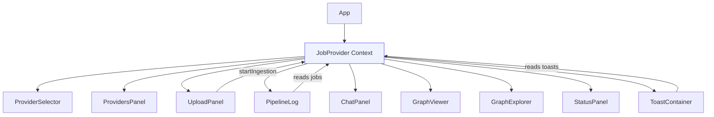
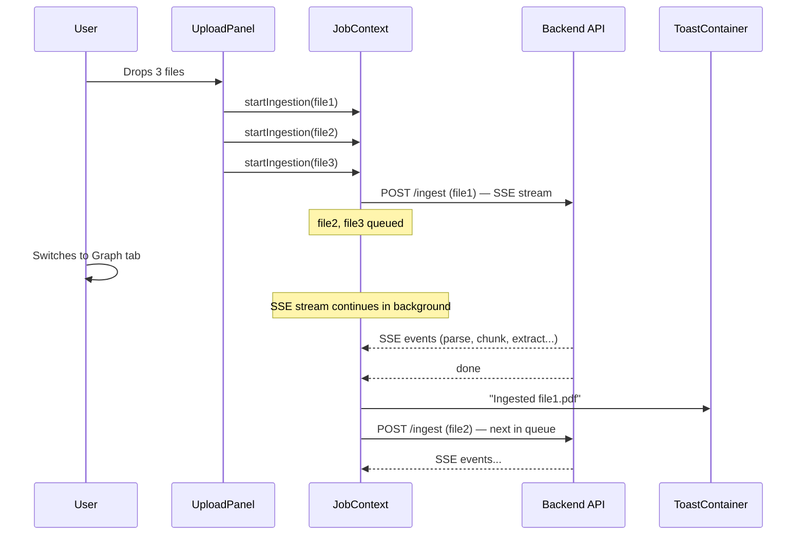
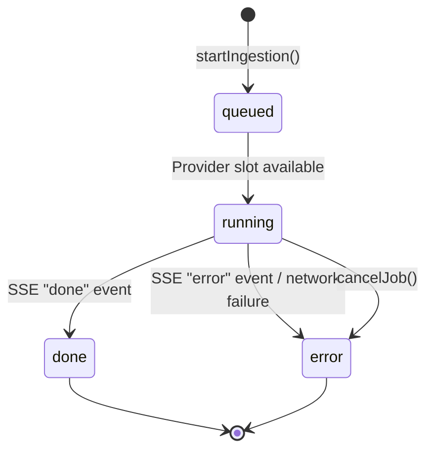

# Async UI Architecture

The frontend uses a non-blocking, event-driven architecture so that long-running operations (ingestion, queries) never freeze the UI.

## Core Principles

1. **All tabs stay mounted** — CSS visibility controls which tab is shown, not React conditional rendering. SSE streams, graph state, and chat history survive tab switches.

2. **Global job tracker** — Ingestion jobs are managed by a React Context (`JobContext`) at the app level, not inside individual components.

3. **Multi-file queue** — Users can drop multiple files for ingestion. Files process sequentially per provider but the UI remains interactive.

4. **Toast notifications** — Background job completions are surfaced via toast notifications, even when the user is on a different tab.

## Component Architecture



## Tab Mounting Strategy

### Before (blocking)

```tsx
// Component unmounts on tab switch — kills SSE streams, loses state
{tab === 'ingest' && <UploadPanel />}
```

### After (non-blocking)

```tsx
// All tabs stay alive, CSS controls visibility
<div style={{ display: tab === 'ingest' ? 'flex' : 'none' }}>
  <UploadPanel />
</div>
```

## JobContext

The `JobContext` is the core of the async system. It manages:

- **Jobs** — each ingestion is a `Job` object with status, events, and abort handle
- **Toasts** — notifications for completed/failed jobs
- **Queue** — sequential processing per provider to avoid store race conditions



### Job Lifecycle



### Job Interface

```typescript
interface Job {
  id: string           // Unique job ID
  providerId: string   // Which provider this job belongs to
  filename: string     // Original filename
  docType: string      // Document type (pdf, sop, etc.)
  status: JobStatus    // 'queued' | 'running' | 'done' | 'error'
  events: PipelineEvent[]  // SSE events received so far
  startedAt: Date
  finishedAt: Date | null
  errorMessage: string | null
}
```

## Activity Indicators

The Ingest tab shows a pulsing dot when any job is running or queued:

```
Providers  [Ingest ●]  Graph  Query  Status
                   ^ pulsing amber dot
```

This gives users awareness of background work regardless of which tab they're on.

## Toast Notifications

Toasts appear in the bottom-right corner and auto-dismiss after 6 seconds.

- **Success** — green checkmark, shown when ingestion completes
- **Error** — red X, shown when ingestion fails, includes error detail
- **Info** — blue info icon, for general notifications

## Multi-File Upload Flow

The `UploadPanel` supports drag-and-drop of multiple files:

1. User drops files into the dropzone
2. Files appear in a queue with per-file document type selectors
3. User clicks "Ingest N Files"
4. Each file is submitted to `JobContext.startIngestion()`
5. Files process sequentially per provider
6. Progress visible in the PipelineLog (with job selector dropdown)
7. The UploadPanel shows a "Recent Jobs" summary

## PipelineLog

The PipelineLog reads from `JobContext` instead of receiving events via props:

- When multiple jobs exist for a provider, a dropdown lets users switch between them
- The progress stepper, chunk progress bar, and event log all reflect the selected job
- New events auto-scroll into view

## File Structure

```
frontend/src/
├── context/
│   └── JobContext.tsx          # Global job tracker + toast manager
├── components/
│   ├── ProvidersPanel.tsx      # Provider CRUD tab
│   ├── UploadPanel.tsx         # Multi-file upload with queue
│   ├── PipelineLog.tsx         # Job-aware pipeline log
│   ├── ProviderSelector.tsx    # Header dropdown (select-only)
│   ├── ToastContainer.tsx      # Notification toasts
│   ├── ChatPanel.tsx           # Query interface
│   ├── GraphViewer.tsx         # Reasoning subgraph
│   ├── GraphExplorer.tsx       # Full graph explorer
│   └── StatusPanel.tsx         # System health
└── App.tsx                     # Tab orchestration + JobProvider wrapper
```
