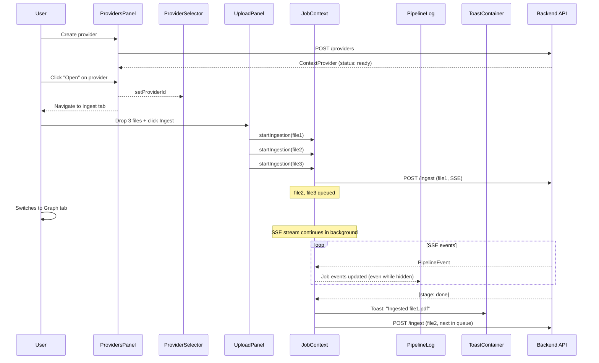

# Frontend Architecture

React 18 + TypeScript + Vite. CSS Modules with a light theme. No UI framework.

## Component Tree

```
App (wrapped in JobProvider)
├── Header
│   ├── Brand (logo + title)
│   ├── Tab Navigation (Providers, Ingest ●, Graph, Query, Status)
│   └── ProviderSelector — dropdown (select-only)
│
├── Providers Tab
│   └── ProvidersPanel  — card grid with create/edit/delete + stats
│
├── Ingest Tab
│   ├── UploadPanel     — multi-file drag-and-drop queue
│   └── PipelineLog     — job-aware SSE progress with stepper + job selector
│
├── Graph Tab
│   └── GraphExplorer   — force-directed graph from real Neo4j data (react-force-graph-2d)
│
├── Query Tab
│   ├── ChatPanel       — question input + markdown answers
│   └── GraphViewer     — ReasoningSubgraph with anchor highlighting
│
├── Status Tab
│   └── StatusPanel     — service health, Milvus collections, provider stats
│
└── ToastContainer      — bottom-right notification toasts
```

## Layout

The app uses a tab-based layout. **All tabs stay mounted** (CSS visibility) so that SSE streams, graph state, and chat history survive tab switches.

```
┌──────────────────────────────────────────────────────────────────────────┐
│ T Trident │ [Providers] [Ingest ●] [Graph] [Query] [Status] │ [Prov ▾] │
├──────────────────────────────────────────────────────────────────────────┤
│                                                                          │
│  Providers: ┌─ProvidersPanel─────────────────────────────────────────┐  │
│             │ [Create Provider]                                       │  │
│             │ ┌─Card────────┐ ┌─Card────────┐ ┌─Card────────┐       │  │
│             │ │ Name  READY │ │ Name INGEST │ │ Name  READY │       │  │
│             │ │ Description │ │ Description │ │ Description │       │  │
│             │ │ Stats grid  │ │ Stats grid  │ │ Stats grid  │       │  │
│             │ │ [Open][Edit]│ │ [Open][Edit]│ │ [Open][Edit]│       │  │
│             │ └─────────────┘ └─────────────┘ └─────────────┘       │  │
│             └────────────────────────────────────────────────────────┘  │
│                                                                          │
│  Ingest:    ┌─UploadPanel─────────────────────────────────────┐         │
│             │ Drop files (multi) │ File queue │ [Ingest 3 Files] │     │
│             └──────────────────────────────────────────────────┘         │
│             ┌─PipelineLog────────────────────────────────────────────┐  │
│             │ [Job selector ▾]                                        │  │
│             │ Stepper: Parse > Chunk > Extract > Resolve > Store      │  │
│             │ Event log entries                                        │  │
│             └─────────────────────────────────────────────────────────┘  │
│                                                                          │
│  (Graph, Query, Status tabs unchanged)                                   │
└──────────────────────────────────────────────────────────────────────────┘
```

## Async Data Flow



## Component Details

### ProvidersPanel (NEW)

| Feature | Implementation |
|---------|---------------|
| List providers | `GET /providers` with stats via `GET /providers/{id}/stats` |
| Create | Modal with name → auto-slug, description. `POST /providers` |
| Edit | Inline edit form. `PATCH /providers/{id}` |
| Delete | Confirmation prompt. `DELETE /providers/{id}` (cascading) |
| Open | Selects provider + navigates to Ingest tab |
| Status badge | Color-coded: ready=green, ingesting=amber, error=red |
| Stats grid | Documents, Nodes, Chunks, Entities, Concepts, Procedures |
| Empty state | CTA to create first provider |

### ProviderSelector (simplified)

| Feature | Implementation |
|---------|---------------|
| Load providers | `GET /providers` on mount + poll every 10s |
| Select provider | `<select>` dropdown |
| No creation | Creation moved to ProvidersPanel |

### UploadPanel (multi-file)

| Feature | Implementation |
|---------|---------------|
| File selection | Drag-and-drop zone supporting multiple files |
| File queue | List with per-file doc type selector + remove button |
| Auto doc type | Extension mapping |
| Ingest all | Submits all queued files to JobContext |
| Recent jobs | Summary of last 5 jobs for the selected provider |

### PipelineLog (job-aware)

| Feature | Implementation |
|---------|---------------|
| Job selector | Dropdown when multiple jobs exist for a provider |
| Reads from JobContext | No longer receives events via props |
| Progress stepper | Unchanged — shows Parse → Chunk → Extract → Resolve → Store → Done |
| Chunk progress bar | Shows during extraction |
| Auto-scroll | On new events |

### ToastContainer (NEW)

| Feature | Implementation |
|---------|---------------|
| Position | Fixed bottom-right, stacks upward |
| Types | Success (green), Error (red), Info (blue) |
| Auto-dismiss | 6 seconds |
| Manual dismiss | X button |
| Slide-in animation | From right |

## API Client (`src/api/client.ts`)

Typed functions wrapping `fetch`:

| Function | Method | Path |
|----------|--------|------|
| `fetchHealth()` | GET | `/api/health` |
| `fetchProviders()` | GET | `/api/providers` |
| `fetchProvider(id)` | GET | `/api/providers/{id}` |
| `createProvider(req)` | POST | `/api/providers` |
| `updateProvider(id, req)` | PATCH | `/api/providers/{id}` |
| `deleteProvider(id)` | DELETE | `/api/providers/{id}` |
| `fetchProviderStats(id)` | GET | `/api/providers/{id}/stats` |
| `fetchGraph(id)` | GET | `/api/providers/{id}/graph` |
| `fetchNodeDetail(id, nodeId)` | GET | `/api/providers/{id}/graph/{nodeId}` |
| `ingestDocument(...)` | POST | `/api/ingest` (SSE via ReadableStream) |
| `queryProvider(req)` | POST | `/api/query` |

All requests go through `/api` prefix, which Vite proxies to `backend:8000`.

### TypeScript Interfaces

Key types defined in `src/types/index.ts`:

| Interface | Fields |
|-----------|--------|
| `ContextProvider` | provider_id, name, description, status, created_at, doc_count, node_count, edge_count, chunk_count, last_ingested_at |
| `ProviderStatus` | `'ready' \| 'ingesting' \| 'error'` |
| `CreateProviderRequest` | provider_id, name, description |
| `UpdateProviderRequest` | name?, description? |
| `GraphNode` | node_id, label, properties, relevance? |
| `GraphEdge` | source, target, edge_type |
| `ReasoningSubgraph` | nodes, edges, anchor_node_ids |
| `QueryResponse` | answer, reasoning_subgraph, graph_nodes, chunks_used, procedures, provider_id |
| `HealthResponse` | status, stores (neo4j, milvus with collections) |
| `ProviderStats` | nodes, chunks, entities, concepts, propositions, procedures |

## Styling

- **Theme**: Light
- **Font**: Inter via Google Fonts
- **CSS Modules**: Scoped per-component
- **Animations**: `fadeIn` on chat, `bounce` on loading, `pulse` on active stepper/activity dot, `slideIn` on toasts
- **Responsive**: ResizeObserver for graph containers

## File Structure

```
frontend/src/
├── main.tsx
├── App.tsx                     # Tab orchestration + JobProvider wrapper
├── App.module.css
├── index.css                   # CSS variables + global styles
├── types/
│   └── index.ts                # Shared TypeScript interfaces
├── api/
│   └── client.ts               # Typed API client
├── context/
│   └── JobContext.tsx           # Global job tracker + toast manager
└── components/
    ├── ProvidersPanel.tsx/css   # Provider CRUD tab
    ├── ProviderSelector.tsx/css # Header dropdown
    ├── UploadPanel.tsx/css      # Multi-file upload
    ├── PipelineLog.tsx/css      # Job-aware pipeline log
    ├── ToastContainer.tsx/css   # Notification toasts
    ├── ChatPanel.tsx/css        # Query interface
    ├── GraphViewer.tsx/css      # Reasoning subgraph
    ├── GraphExplorer.tsx/css    # Full graph explorer
    ├── GraphHits.tsx/css        # Query result nodes
    └── StatusPanel.tsx/css      # System health
```
