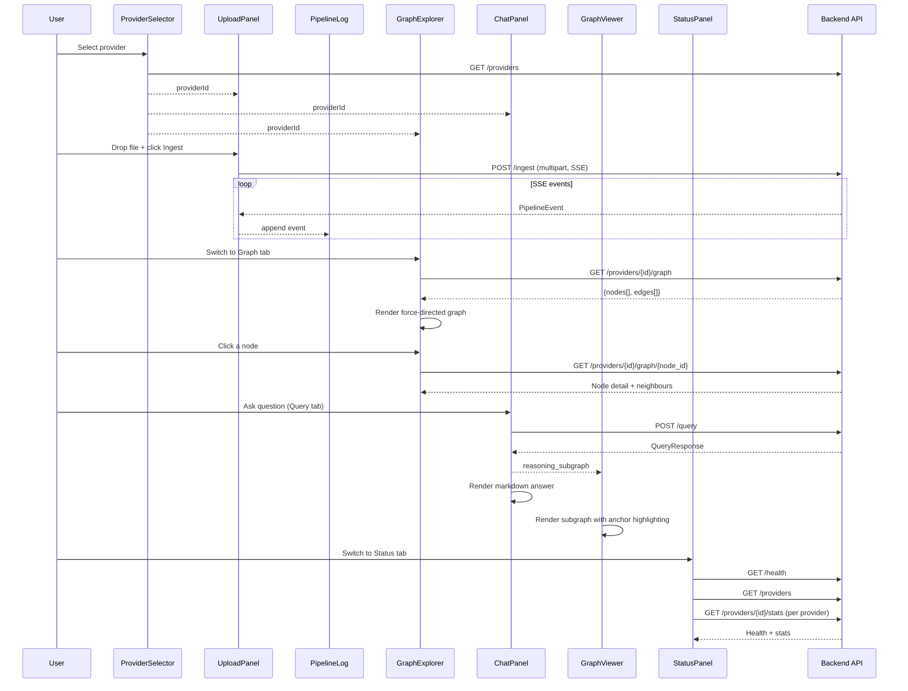

# Frontend Architecture

React 18 + TypeScript + Vite. CSS Modules with a light theme. No UI framework.

## Component Tree

```
App
├── Header
│   ├── Brand (logo + title)
│   ├── Tab Navigation (Ingest, Graph, Query, Status)
│   └── ProviderSelector — dropdown + "New Provider" modal
│
├── Ingest Tab
│   ├── UploadPanel     — drag-and-drop file input + doc type selector
│   └── PipelineLog     — live SSE progress with stepper + chunk progress bar
│
├── Graph Tab
│   └── GraphExplorer   — force-directed graph from real Neo4j data (react-force-graph-2d)
│
├── Query Tab
│   ├── ChatPanel       — question input + markdown answers
│   └── GraphViewer     — ReasoningSubgraph with anchor highlighting
│
└── Status Tab
    └── StatusPanel     — service health, Milvus collections, provider stats
```

## Layout

The app uses a tab-based layout. The header contains the brand, tab navigation, and provider selector. Each tab renders its own main content area.

```
┌─────────────────────────────────────────────────────────────────────────┐
│ T Trident  │ [Ingest] [Graph] [Query] [Status]  │ [Provider ▾] [+ New] │
├─────────────────────────────────────────────────────────────────────────┤
│                                                                         │
│                        Tab Content Area                                 │
│                                                                         │
│  Ingest:   ┌─UploadPanel─┐  ┌─PipelineLog──────────────────────────┐  │
│            │ file + type  │  │ Stepper: Parse > Chunk > Extract ... │  │
│            └──────────────┘  │ Chunk progress: [██████░░░░] 3/24   │  │
│                              │ Event log entries                    │  │
│                              └─────────────────────────────────────┘  │
│                                                                         │
│  Graph:    ┌─────────────────────────────────────────────────────────┐  │
│            │  GraphExplorer (force-directed canvas)  │  Node Detail  │  │
│            │  [All types ▾] [Refresh]  Legend         │  Properties   │  │
│            │  Nodes + edges from GET /providers/{id}/graph           │  │
│            └─────────────────────────────────────────────────────────┘  │
│                                                                         │
│  Query:    ┌─ChatPanel──────────────┐ ┌─GraphViewer─────────────────┐  │
│            │ question + answers      │ │ ReasoningSubgraph           │  │
│            │ metadata badges         │ │ Anchor nodes: dashed ring   │  │
│            └─────────────────────────┘ │ Edges with labels           │  │
│                                        └────────────────────────────┘  │
│                                                                         │
│  Status:   ┌─StatusPanel────────────────────────────────────────────┐  │
│            │ Services: Backend API | Neo4j | Milvus                  │  │
│            │ Collections: ks_xxx | ps_xxx | gn_xxx                   │  │
│            │ Providers: name, stats (nodes, chunks, entities...)     │  │
│            └─────────────────────────────────────────────────────────┘  │
└─────────────────────────────────────────────────────────────────────────┘
```

## Data Flow



## Component Details

### ProviderSelector

| Feature | Implementation |
|---------|---------------|
| Load providers | `GET /providers` on mount |
| Select provider | `<select>` dropdown |
| Create provider | Modal → `POST /providers` |
| Validation | ID + Name required |

### UploadPanel

| Feature | Implementation |
|---------|---------------|
| File selection | Drag-and-drop zone + click-to-browse |
| Auto doc type | Extension mapping (`.pdf`→pdf, `.csv`→csv, `.sop`→sop, `.sql`→ddl) |
| Override doc type | `<select>` dropdown |
| Upload | `POST /ingest` multipart via `fetch` + ReadableStream for SSE |
| Cancel | AbortController |

### PipelineLog

| Feature | Implementation |
|---------|---------------|
| Progress stepper | Horizontal stepper showing Parse → Chunk → Extract → Resolve → Store → Done |
| Step states | Done (checkmark), Active (pulse animation), Pending (grey) |
| Chunk progress bar | Shows "Extracting chunk N/M" with a fill bar during extraction |
| Overall progress bar | Percentage based on current stage position |
| Live updates | Events pushed from UploadPanel |
| Stage icons | Emoji per stage |
| Stage colors | Color-coded by stage type |
| Warnings | Amber styling for warning events |
| Detail JSON | Collapsible `<pre>` per event |
| Auto-scroll | `scrollIntoView` on new events |

### GraphExplorer

| Feature | Implementation |
|---------|---------------|
| Data source | `GET /providers/{id}/graph` — real Neo4j data |
| Rendering | `react-force-graph-2d` (ForceGraph2D) with custom canvas painting |
| Node shapes | Circles for most types; rounded rectangles for Step nodes (with step number) |
| Node colors | Entity=indigo, Concept=purple, Proposition=amber, Procedure=green, Step=teal, Chunk=slate, Document=grey, TableSchema=orange |
| Node sizes | Procedure=12, Document=10, Entity=8, Concept=7, Step=7, Proposition=5, Chunk=4 |
| Edge colors | PRECEDES=teal, HAS_STEP=green, REFERENCES=indigo, MENTIONS=indigo, DEFINES=purple, CONTAINS=slate |
| Filtering | Type filter dropdown + clickable legend badges |
| Node click | Fetches `GET /providers/{id}/graph/{node_id}` for detail panel |
| Detail panel | Properties grid + neighbour list (clickable to navigate) |
| Reload | Manual refresh button |
| Responsive | ResizeObserver for container dimensions |

### ChatPanel

| Feature | Implementation |
|---------|---------------|
| Input | Text field + Enter to submit |
| Query | `POST /query` |
| Answer | Rendered as Markdown via `react-markdown` |
| Loading | Bouncing dots animation |
| History | Local state (array of messages) |
| Metadata | Procedure names, chunk count, graph node count shown as badges below answer |
| Reasoning | `onReasoning` callback passes `reasoning_subgraph` to GraphViewer |

### GraphViewer (Reasoning Subgraph)

| Feature | Implementation |
|---------|---------------|
| Data source | `ReasoningSubgraph` from `QueryResponse.reasoning_subgraph` |
| Rendering | `react-force-graph-2d` with custom canvas painting |
| Anchor highlighting | Dashed ring around anchor nodes (from `anchor_node_ids`) |
| Selection | Click to select; highlight connected edges |
| Node detail | Side panel with properties + connections list |
| Edge labels | Shown on hover |
| Link width | Selected node's edges thicker (2.5 vs 0.6) |
| Stats bar | Shows "N nodes, M edges, K anchors" |
| Empty state | Prompt to ask a question |

### StatusPanel

| Feature | Implementation |
|---------|---------------|
| Service health | Cards for Backend API, Neo4j, Milvus with green/red status dots |
| Milvus collections | Badge list of all collections (ks_, ps_, gn_) |
| Provider stats | Card per provider showing nodes, chunks, entities, concepts, propositions, procedures |
| Auto-refresh | Polls every 15 seconds |
| Manual refresh | Refresh button with spinning animation |
| Port display | Shows service ports |

## Styling

- **Theme**: Light
- **Font**: Inter via Google Fonts
- **Animations**: `fadeIn` on chat messages, `bounce` on loading dots, `pulse` on active stepper step
- **Responsive**: ResizeObserver for graph containers

## API Client (`src/api/client.ts`)

Typed functions wrapping `fetch`:

| Function | Method | Path |
|----------|--------|------|
| `fetchHealth()` | GET | `/api/health` |
| `fetchProviders()` | GET | `/api/providers` |
| `createProvider(req)` | POST | `/api/providers` |
| `deleteProvider(id)` | DELETE | `/api/providers/{id}` |
| `fetchProviderStats(id)` | GET | `/api/providers/{id}/stats` |
| `fetchGraph(id)` | GET | `/api/providers/{id}/graph` |
| `fetchNodeDetail(id, nodeId)` | GET | `/api/providers/{id}/graph/{nodeId}` |
| `ingestDocument(...)` | POST | `/api/ingest` (SSE via ReadableStream) |
| `queryProvider(req)` | POST | `/api/query` |

All requests go through `/api` prefix, which Vite proxies to `backend:8000`.

### TypeScript Interfaces

Key types defined in `src/types/index.ts`:

| Interface | Fields |
|-----------|--------|
| `GraphNode` | node_id, label, properties, relevance? |
| `GraphEdge` | source, target, edge_type |
| `ReasoningSubgraph` | nodes, edges, anchor_node_ids |
| `QueryResponse` | answer, reasoning_subgraph, graph_nodes, chunks_used, procedures, provider_id |
| `HealthResponse` | status, stores (neo4j, milvus with collections) |
| `ProviderStats` | nodes, chunks, entities, concepts, propositions, procedures |

Client also exports `GraphData` and `NodeDetail` interfaces for the Graph Explorer endpoints.
