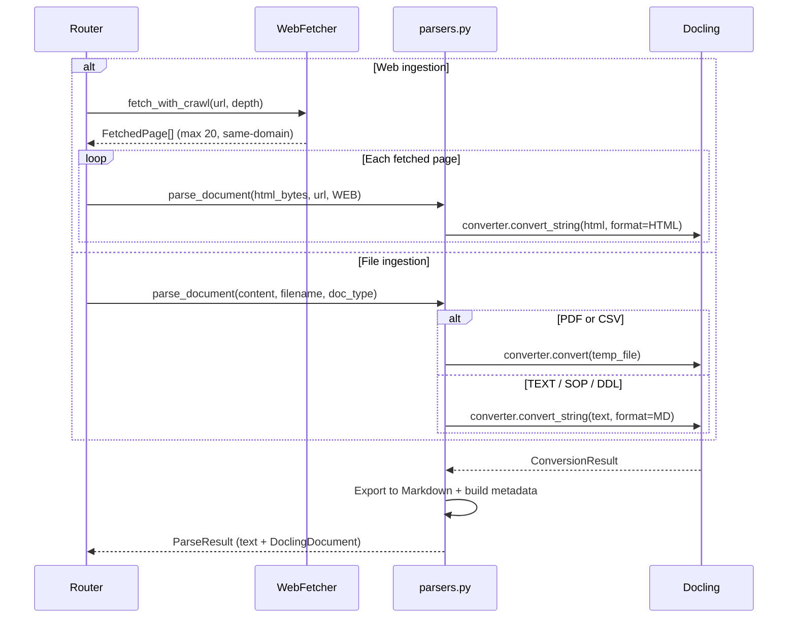
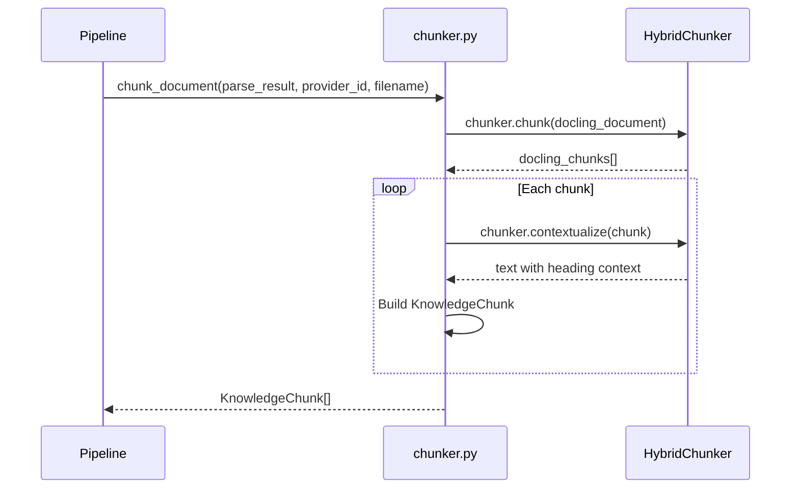
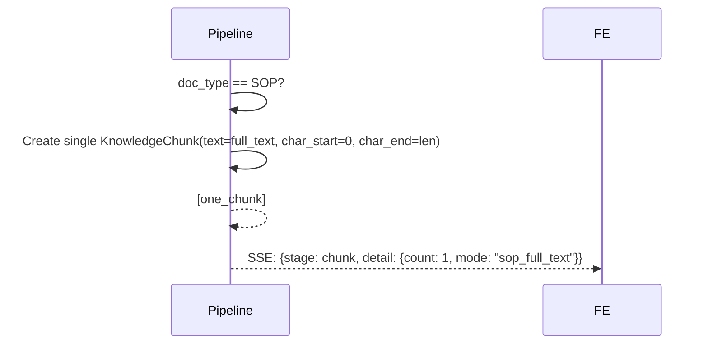
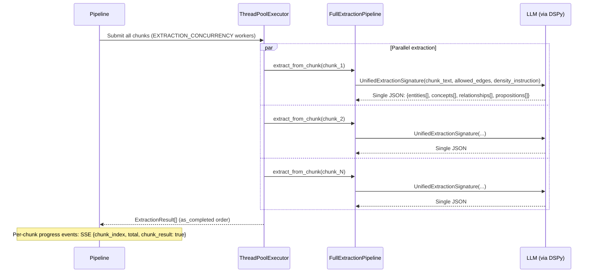
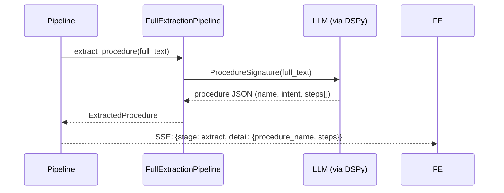
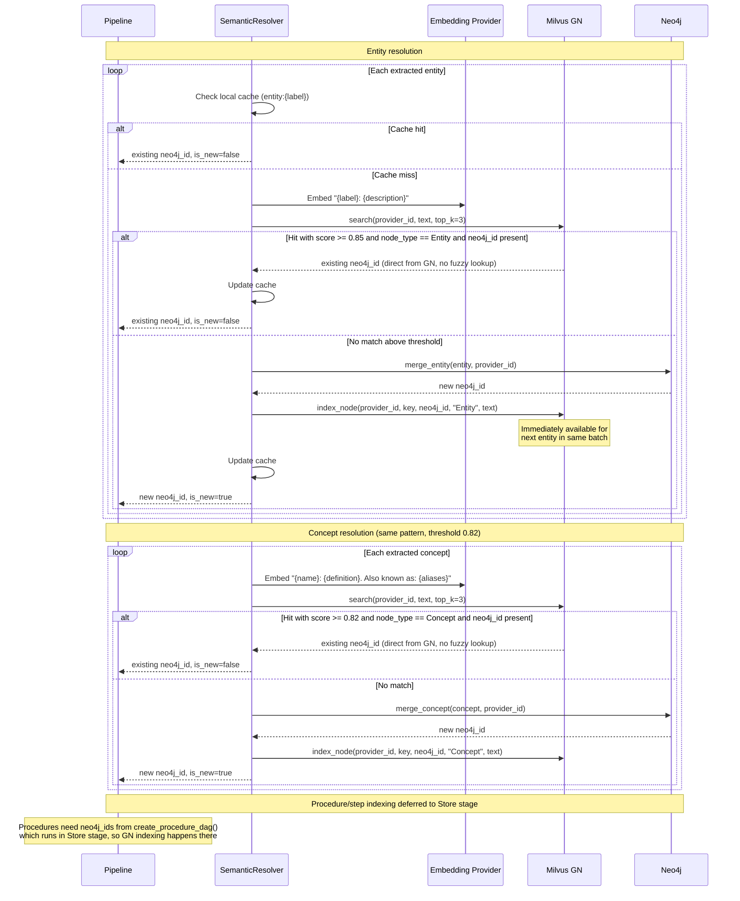
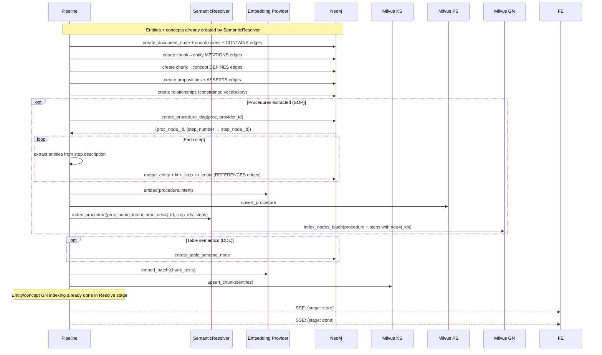

# Ingestion Pipeline

The ingestion pipeline converts raw documents (files and web pages) into structured knowledge across four stores. It uses **Docling** for document parsing and chunking, and **DSPy** for LLM-driven extraction. Chunk extraction runs in parallel using a configurable thread pool.

## Pipeline Overview

```
  Upload / URL                                                              Four Stores
    ┌──────────┐     ┌───────┐     ┌───────┐     ┌─────────┐     ┌─────────┐     ┌─────────┐
    │ File/Web │────▶│ Parse │────▶│ Chunk │────▶│ Extract │────▶│ Resolve │────▶│  Store  │
    └──────────┘     └───────┘     └───────┘     └─────────┘     └─────────┘     └─────────┘
                      Docling       Docling        DSPy           Semantic        Neo4j
                      Document      Hybrid         Unified        Resolver       + Milvus KS
                      Converter     Chunker        Extraction     (embed →       + Milvus PS
                     (incl HTML)   (or SOP        (parallel,      cosine GN     + Milvus GN
                                    bypass)        1 call/chunk,   → merge,       (procs in
                                                   configurable    neo4j_id        Store)
                                                   concurrency)    linkage)
```

## Web Ingestion Pre-Stage — Fetch

For `DocumentType.WEB`, the pipeline is preceded by a fetch stage handled by `web_fetcher.py`. The fetcher downloads HTML pages with optional same-domain crawling.

| Parameter | Default | Description |
|-----------|---------|-------------|
| `depth` | 0 | 0 = single page. 1-3 = follow links on each page to that depth. Capped at 3. |
| `max_pages` | 20 | Safety cap on total pages fetched per crawl. |
| Same-domain | Enforced | Only follows links on the same domain as the starting URL. |
| Non-HTML skip | Enforced | Skips URLs returning non-`text/html` content types. |
| Extension filter | Enforced | Skips links to images, CSS, JS, fonts, PDFs, archives. |

Each fetched page becomes a `FetchedPage(url, html, title)`. Each page runs through the full 5-stage pipeline independently. The URL is used as the `filename`.

## Stage 1 — Parse (Docling DocumentConverter)

Docling converts documents in **light mode** — no OCR, fast table structure detection.

| Document Type | Docling Path | Notes |
|---------------|-------------|-------|
| PDF | `converter.convert(file)` | No OCR, `TableFormerMode.FAST` |
| TEXT | `converter.convert_string(text, format=MD)` | Treated as Markdown |
| SOP | `converter.convert_string(text, format=MD)` | Same as TEXT, triggers procedure extraction downstream |
| CSV | `converter.convert(file)` | Native Docling CSV support |
| DDL | `converter.convert_string(text, format=MD)` | Triggers DB semantics extraction downstream |
| WEB | `converter.convert_string(html, format=HTML)` | HTML fetched by `web_fetcher.py`, converted via Docling HTML path |

Output: `ParseResult` containing the full text (as Markdown) and the `DoclingDocument` object.



## Stage 2 — Chunk (Docling HybridChunker or SOP Bypass)

### Standard Documents (PDF, TEXT, CSV, DDL)

Uses Docling's `HybridChunker` for **structure-aware, token-aware** chunking:

- Starts from the document's hierarchical structure (headings, paragraphs, tables)
- Splits oversized elements, merges undersized adjacent peers
- Token counting via OpenAI's `cl100k_base` tokenizer
- `contextualize()` prepends heading context to each chunk for better embeddings



### SOP Documents — No Chunking

SOPs are treated as a single unit. The full parsed text becomes one `KnowledgeChunk`:



This ensures the full SOP context is available for procedure extraction in Stage 3.

### Why Docling over naive sliding window?

| Feature | Naive Sliding Window | Docling HybridChunker |
|---------|---------------------|----------------------|
| Respects headings | No — splits mid-sentence | Yes — heading context preserved |
| Table handling | Breaks tables across chunks | Keeps tables intact |
| Token-aware | No — character-based | Yes — uses tokenizer |
| Merge small sections | No | Yes — `merge_peers=True` |
| Heading context | Lost | Prepended via `contextualize()` |

A text fallback (`_chunk_text_fallback`) exists for cases where no `DoclingDocument` is available.

## Stage 3 — Extract (DSPy — Unified)

Extraction depends on the document type. Standard documents use a **single unified LLM call per chunk** that returns entities, concepts, relationships, and propositions together.

### Standard Documents (PDF, TEXT, CSV, WEB)

One `UnifiedExtractionSignature` call per chunk via `dspy.ChainOfThought`. The LLM receives the chunk text, the allowed edge vocabulary, and a density instruction, then returns a single JSON object with four arrays. Chunks are processed **in parallel** using a `ThreadPoolExecutor` with `EXTRACTION_CONCURRENCY` workers (default 4).

**Why unified?**
- The LLM sees all extracted entities when creating relationships, producing denser and more accurate edges.
- Propositions use entity labels as subject/object, cross-linking them to the graph.
- 75% fewer API calls compared to the old 4-signature approach (faster and cheaper).
- Edge vocabulary is enforced in the same call context as entity extraction.



The `UnifiedExtractionSignature` prompt instructs the LLM to:
- Return `entities` as `[{label, entity_type, description}]`
- Return `concepts` as `[{name, definition, aliases}]`
- Return `relationships` as `[{source_label, edge_type, target_label, confidence}]` using only allowed edges
- Return `propositions` as `[{subject, predicate, object}]` grounded in entity labels

### Extraction Density Control

The `EXTRACTION_DENSITY` environment variable (`low`, `medium`, or `high`) controls the default number of nodes and edges the LLM extracts per chunk. The density instruction is injected into the unified prompt. The `density` parameter on `POST /ingest` **overrides** the environment variable on a per-ingest basis. The frontend UploadPanel exposes this as a dropdown.

| Density | Entities | Concepts | Relationships | Propositions | Use case |
|---------|----------|----------|---------------|--------------|----------|
| `low` | 3-5 | 1-3 | 2-4 | 2-4 | Quick summaries, cost-sensitive |
| `medium` (default) | 5-10 | 2-5 | 4-8 | 4-8 | Balanced coverage |
| `high` | All found | All found | All found | All found | Comprehensive extraction |

Set in `.env` (default):
```env
EXTRACTION_DENSITY=medium   # low | medium | high
```

Or override per-ingest via the `density` form field on `POST /ingest`.

### SOP Documents

No per-chunk extraction. The full text goes directly to `ProcedureSignature` (unchanged -- this is a separate LLM call on full text, not per-chunk):



### DDL Documents

Table semantics are extracted via `DBSemanticsSignature` on full text (unchanged -- separate LLM call), then per-chunk unified extraction runs for entities/concepts/relationships/propositions.

### Extraction failure handling

- All DSPy outputs are JSON strings parsed with `try/except`
- On parse failure: log warning, return empty list/dict -- **never crash the pipeline**
- Failed chunks emit an SSE warning event to the frontend

## Stage 4 — Resolve (Semantic Deduplication + GN Indexing)

Resolution is **semantic**, not keyword-based. The `SemanticResolver` (`backend/ingestion/resolver.py`) embeds each candidate node's label+description, searches the GN index for cosine-similar matches, and merges if above threshold. New nodes are indexed in GN **immediately** so that subsequent candidates in the same batch can resolve against them.

This stage handles **both** entities and concepts. Procedures/steps are indexed in GN but never resolved (always created as new).

### Embedding Input Text by Node Type

| Node Type | Embedding Input Text | Example |
|-----------|---------------------|---------|
| Entity | `"{label}: {description}"` (or just `"{label}"` if no description) | `"CID-44821: MPLS circuit between Chicago and NYC"` |
| Concept | `"{name}: {definition}. Also known as: {aliases}"` | `"Monthly Recurring Charge: Fixed monthly fee for service. Also known as: MRC, recurring fee"` |
| Procedure | `"{name}: {intent}"` | `"Circuit Decommission: Safely decommission an MPLS circuit"` |
| Step | `"{description}"` | `"Submit decommission request to NOC via ServiceNow ticket"` |

### Resolution Thresholds

| Node Type | Cosine Threshold | Behaviour |
|-----------|-----------------|-----------|
| Entity | 0.85 | Merge if similarity >= 0.85 |
| Concept | 0.82 | Merge if similarity >= 0.82 |
| Procedure | N/A | Always new — indexed in GN, never resolved |
| Step | N/A | Always new — indexed in GN, never resolved |

### Resolution Flow



## Stage 5 — Store

Writes resolved objects into Neo4j and Milvus. Note that **entity/concept creation and GN indexing already happened in the Resolve stage** via the `SemanticResolver`. This stage handles the remaining graph structure, vector stores, and **procedure GN indexing** (which needs neo4j_ids from DAG creation).

1. **Neo4j**: Document → Chunk nodes + CONTAINS edges, Chunk → Entity MENTIONS edges, Chunk → Concept DEFINES edges, Proposition nodes + edges, Relationship edges
2. **Neo4j (SOP DAG)**: `create_procedure_dag()` returns `(proc_node_id, {step_number → step_node_id})` — Procedure → Step nodes with HAS_STEP, PRECEDES, and REFERENCES edges
3. **Milvus PS**: Embed procedure intents, upsert into `ps_{provider_id}` (SOP docs only)
4. **Milvus GN**: Index procedure + steps with their neo4j_ids (batch) — done here, not in Resolve, because neo4j_ids come from `create_procedure_dag()`
5. **Milvus KS**: Embed chunk texts via embedding provider, upsert into `ks_{provider_id}`

Entity/concept GN indexing is **not** done here — that was already handled incrementally during the Resolve stage. Procedure/step GN indexing **is** done here because it depends on neo4j_ids from DAG creation.



## SSE Event Stream

The pipeline emits `PipelineEvent` objects via an async generator. The frontend consumes them as Server-Sent Events.

| Stage | Example Message | Detail |
|-------|----------------|--------|
| `parse` | "Processing page 1/5: Page Title" | `{url, page_index, total_pages}` (web crawl only, multi-page) |
| `parse` | "Parsed contract.pdf (pdf, 12 pages)" | `{filename, page_count}` |
| `chunk` | "Created 24 chunks" | `{count: 24, avg_chunk_chars}` |
| `chunk` | "SOP treated as single document (no chunking)" | `{count: 1, mode: "sop_full_text"}` |
| `extract` | "Extracting 24 chunks (concurrency=4)..." | `{total: 24, concurrency: 4, progress: true}` |
| `extract` | "Chunk 3/24: 5 entities, 2 concepts" | `{chunk_index, chunk_result: true, new_entities, running_totals}` |
| `extract` | "Extracted 15 entities, 3 concepts..." | `{entities, concepts, ..., summary: true}` |
| `extract` | "Extracted procedure: Circuit Decommission (5 steps)" | `{procedure_name, steps}` |
| `extract` | "Warning: extraction failed for chunk 7" | `{chunk_index: 6, warning: true}` |
| `resolve` | "Resolved 15 entities (12 new, 3 merged), 8 concepts (6 new, 2 merged)" | `{entities_total, entities_new, entities_merged, concepts_total, concepts_new, concepts_merged}` |
| `store` | "Stored document + 24 chunk nodes" | `{store_step: "chunks", nodes, edges}` |
| `store` | "Created entity/concept edges (38 total)" | `{store_step: "edges", nodes, edges}` |
| `store` | "Embedding chunks for vector store..." | `{store_step: "embedding"}` |
| `store` | "Stored 42 nodes, 38 edges, 24 chunks" | `{store_step: "complete", nodes, edges, chunks, procedures, summary: true}` |
| `done` | "Ingestion complete" | `{total_duration_s, stage_times, totals}` |
| `error` | "Parse failed: ..." | — |
