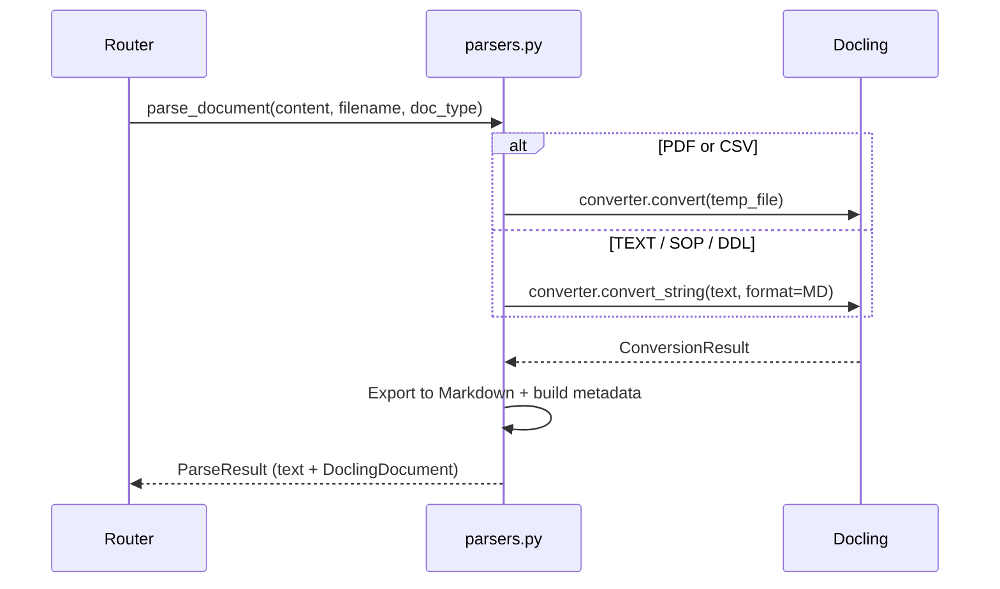
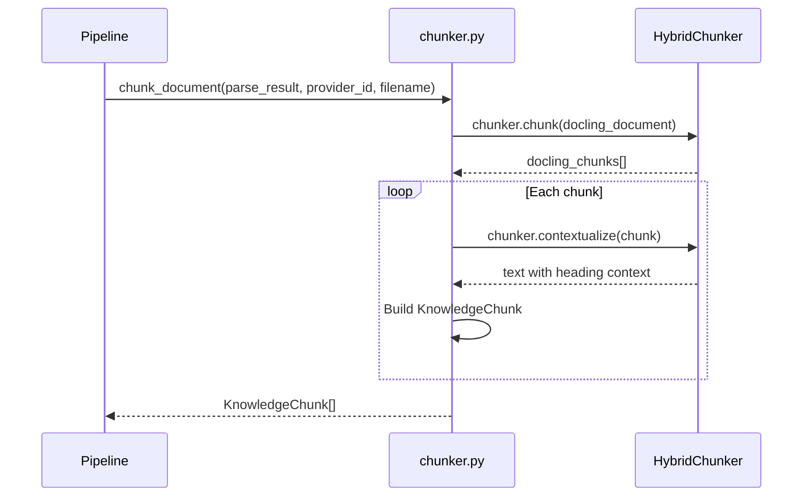
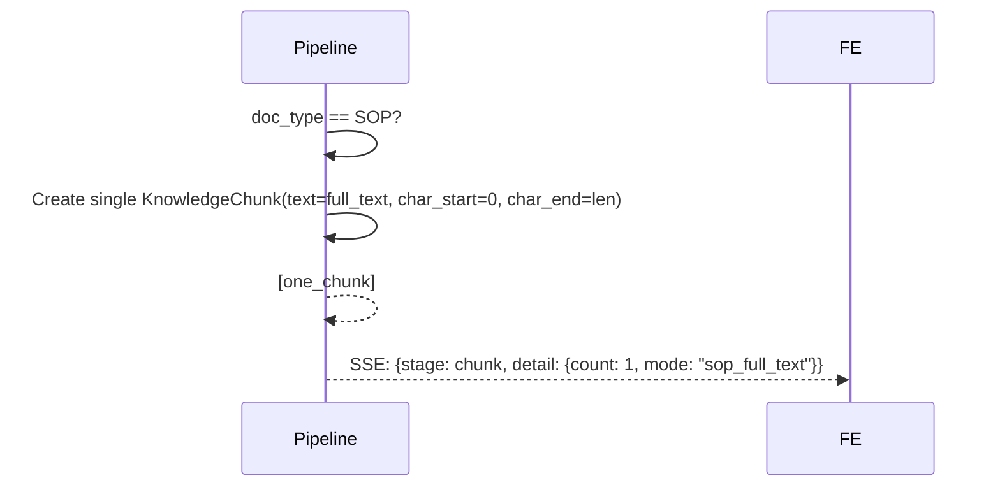
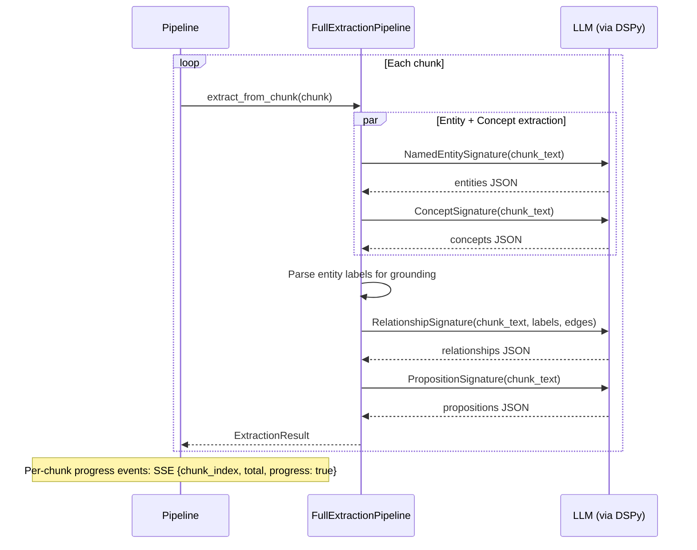
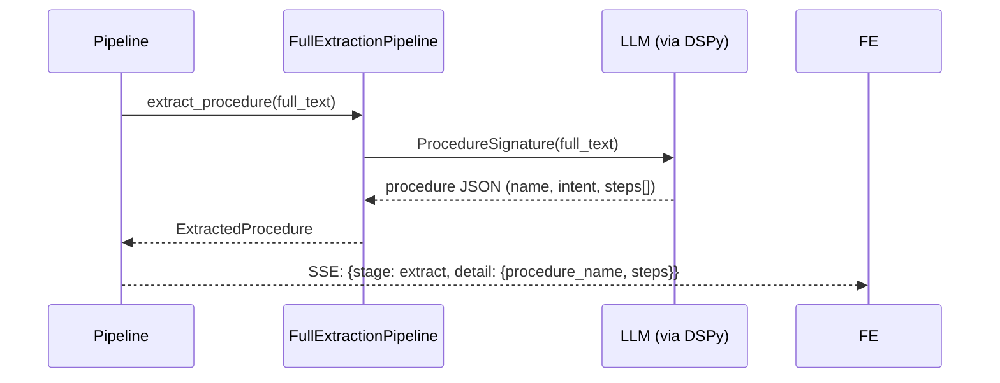
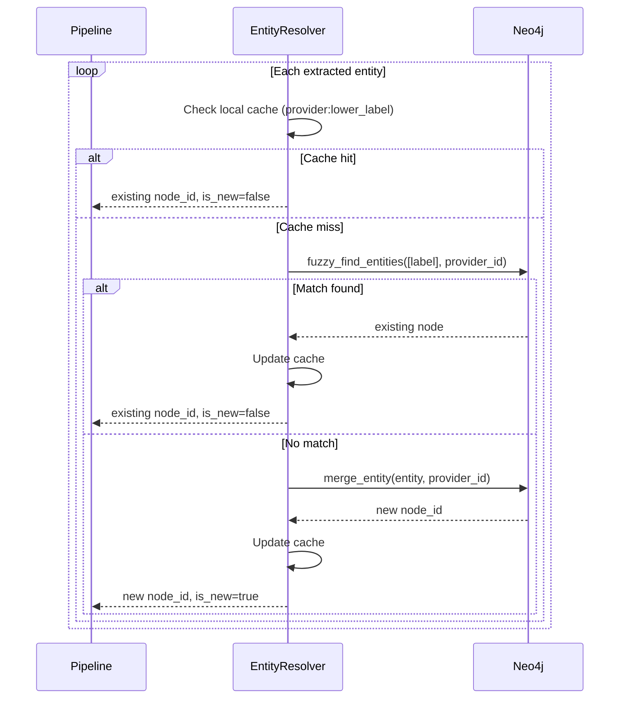
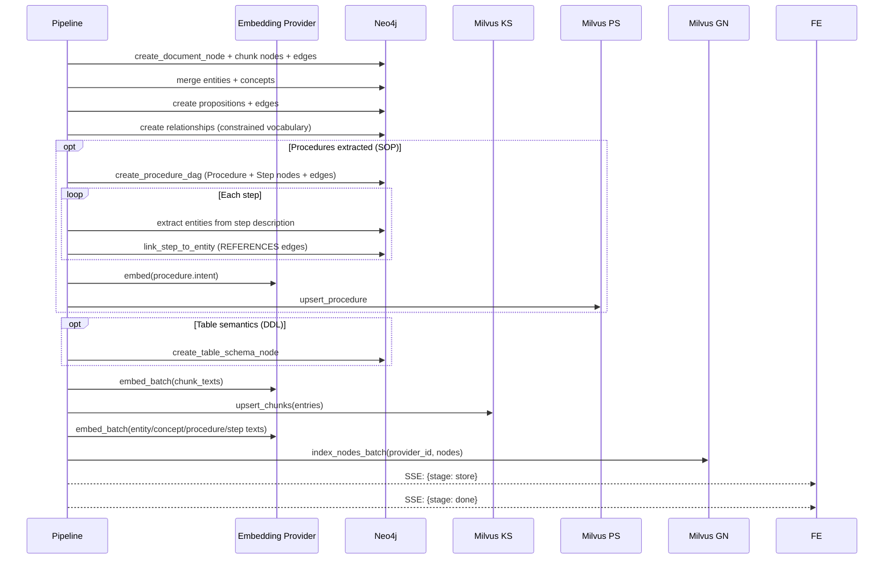

# Ingestion Pipeline

The ingestion pipeline converts raw documents into structured knowledge across four stores. It uses **Docling** for document parsing and chunking, and **DSPy** for LLM-driven extraction.

## Pipeline Overview

```
     Upload                                                              Four Stores
    ┌──────┐     ┌───────┐     ┌───────┐     ┌─────────┐     ┌─────────┐     ┌─────────┐
    │ File │────▶│ Parse │────▶│ Chunk │────▶│ Extract │────▶│ Resolve │────▶│  Store  │
    └──────┘     └───────┘     └───────┘     └─────────┘     └─────────┘     └─────────┘
                  Docling       Docling        DSPy           Neo4j          Neo4j
                  Document      Hybrid         ChainOf        fuzzy          + Milvus KS
                  Converter     Chunker        Thought        match          + Milvus PS
                               (or SOP                                      + Milvus GN
                                bypass)
```

## Stage 1 — Parse (Docling DocumentConverter)

Docling converts documents in **light mode** — no OCR, fast table structure detection.

| Document Type | Docling Path | Notes |
|---------------|-------------|-------|
| PDF | `converter.convert(file)` | No OCR, `TableFormerMode.FAST` |
| TEXT | `converter.convert_string(text, format=MD)` | Treated as Markdown |
| SOP | `converter.convert_string(text, format=MD)` | Same as TEXT, triggers procedure extraction downstream |
| CSV | `converter.convert(file)` | Native Docling CSV support |
| DDL | `converter.convert_string(text, format=MD)` | Triggers DB semantics extraction downstream |

Output: `ParseResult` containing the full text (as Markdown) and the `DoclingDocument` object.



## Stage 2 — Chunk (Docling HybridChunker or SOP Bypass)

### Standard Documents (PDF, TEXT, CSV, DDL)

Uses Docling's `HybridChunker` for **structure-aware, token-aware** chunking:

- Starts from the document's hierarchical structure (headings, paragraphs, tables)
- Splits oversized elements, merges undersized adjacent peers
- Token counting via OpenAI's `cl100k_base` tokenizer
- `contextualize()` prepends heading context to each chunk for better embeddings



### SOP Documents — No Chunking

SOPs are treated as a single unit. The full parsed text becomes one `KnowledgeChunk`:



This ensures the full SOP context is available for procedure extraction in Stage 3.

### Why Docling over naive sliding window?

| Feature | Naive Sliding Window | Docling HybridChunker |
|---------|---------------------|----------------------|
| Respects headings | No — splits mid-sentence | Yes — heading context preserved |
| Table handling | Breaks tables across chunks | Keeps tables intact |
| Token-aware | No — character-based | Yes — uses tokenizer |
| Merge small sections | No | Yes — `merge_peers=True` |
| Heading context | Lost | Prepended via `contextualize()` |

A text fallback (`_chunk_text_fallback`) exists for cases where no `DoclingDocument` is available.

## Stage 3 — Extract (DSPy)

Extraction depends on the document type:

### Standard Documents (PDF, TEXT, CSV)

Four extraction modules run on each chunk. All use `dspy.ChainOfThought` for reasoning.



### SOP Documents

No per-chunk extraction. The full text goes directly to `ProcedureSignature`:



### DDL Documents

Table semantics are extracted first from the full text, then per-chunk extraction runs for entities/concepts.

### Extraction failure handling

- All DSPy outputs are JSON strings parsed with `try/except`
- On parse failure: log warning, return empty list — **never crash the pipeline**
- Failed chunks emit an SSE warning event to the frontend

## Stage 4 — Resolve (Entity Deduplication)

Case-insensitive string matching against existing entities in Neo4j.



## Stage 5 — Store

Writes all resolved objects into four stores in order:

1. **Neo4j**: Document → Chunk → Entity → Concept → Proposition nodes, plus all edges and relationships
2. **Neo4j (SOP DAG)**: Procedure → Step nodes with HAS_STEP, PRECEDES, and REFERENCES edges
3. **Milvus PS**: Embed procedure intents, upsert into `ps_{provider_id}` (SOP docs only)
4. **Milvus KS**: Embed chunk texts via embedding provider, upsert into `ks_{provider_id}`
5. **Milvus GN**: Embed entity/concept/procedure/step labels, upsert into `gn_{provider_id}`



## SSE Event Stream

The pipeline emits `PipelineEvent` objects via an async generator. The frontend consumes them as Server-Sent Events.

| Stage | Example Message | Detail |
|-------|----------------|--------|
| `parse` | "Parsed contract.pdf (pdf, 12 pages)" | `{filename, page_count}` |
| `chunk` | "Created 24 chunks" | `{count: 24}` |
| `chunk` | "SOP treated as single document (no chunking)" | `{count: 1, mode: "sop_full_text"}` |
| `extract` | "Extracting chunk 3/24..." | `{chunk_index: 2, total: 24, progress: true}` |
| `extract` | "Extracted 15 entities, 3 concepts..." | `{entities, concepts, ...}` |
| `extract` | "Extracted procedure: Circuit Decommission (5 steps)" | `{procedure_name, steps}` |
| `extract` | "Warning: extraction failed for chunk 7" | `{chunk_index: 6, warning: true}` |
| `resolve` | "Resolved 15 entities, 12 new, 3 merged" | `{total, new, merged}` |
| `store` | "Stored 42 nodes, 38 edges, 24 chunks" | `{nodes, edges, chunks, procedures}` |
| `done` | "Ingestion complete" | — |
| `error` | "Parse failed: ..." | — |
