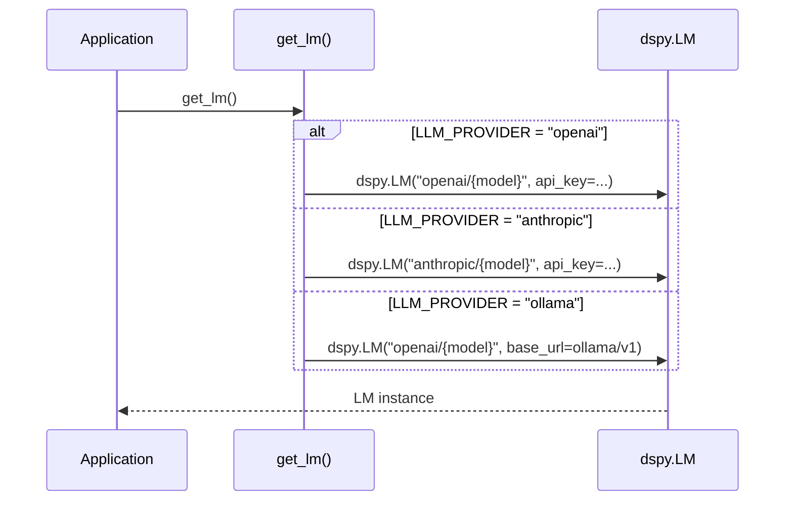
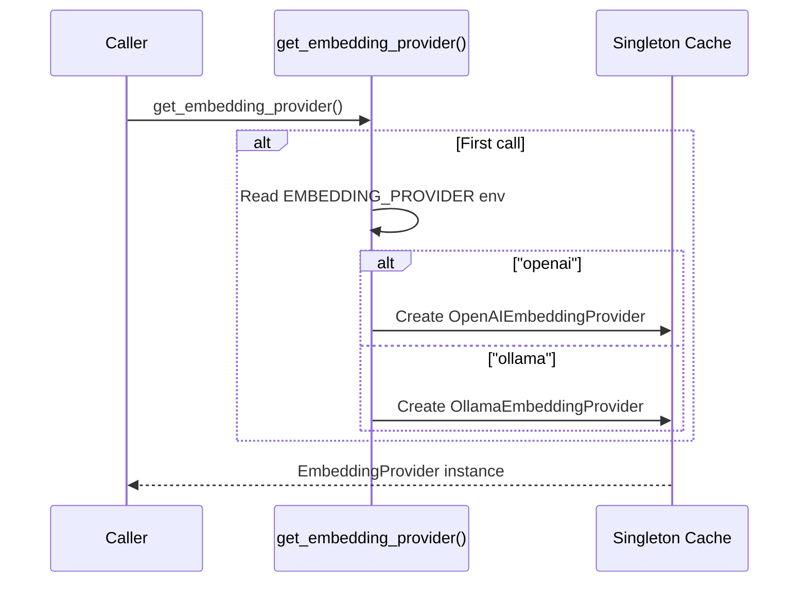

# LLM & Embedding Provider Abstraction

## Overview

Trident separates **LLM** (text generation for extraction/answering) from **Embedding** (vector encoding for search) behind two independent abstractions. Each can be configured to a different provider.

```
┌─────────────────────────────────────────────┐
│              backend/llm/                   │
│                                             │
│  provider.py          embeddings.py         │
│  ┌──────────────┐     ┌──────────────────┐  │
│  │  get_lm()    │     │ EmbeddingProvider │  │
│  │  → dspy.LM   │     │   (abstract)     │  │
│  │              │     │                  │  │
│  │  ┌─openai──┐ │     │  ┌─OpenAI──────┐ │  │
│  │  ├─anthro──┤ │     │  ├─Ollama──────┤ │  │
│  │  └─ollama──┘ │     │  └─(extend)────┘ │  │
│  └──────────────┘     └──────────────────┘  │
└─────────────────────────────────────────────┘
```

## LLM Provider (`provider.py`)

Returns a DSPy `LM` instance used for all extraction and answer generation.

### Configuration

| Env Var | Values | Default |
|---------|--------|---------|
| `LLM_PROVIDER` | `openai`, `anthropic`, `ollama` | `anthropic` |
| `LLM_MODEL` | Any model ID | `claude-sonnet-4-5` |
| `OPENAI_API_KEY` | API key | — |
| `ANTHROPIC_API_KEY` | API key | — |

### Usage

```python
from llm.provider import get_lm

lm = get_lm()  # Returns dspy.LM based on LLM_PROVIDER env var
dspy.configure(lm=lm)
```

### Provider Resolution



## Embedding Provider (`embeddings.py`)

Abstract base class with two implementations. Independent of the LLM provider — you can use Anthropic for LLM and OpenAI for embeddings.

### Configuration

| Env Var | Values | Default |
|---------|--------|---------|
| `EMBEDDING_PROVIDER` | `openai`, `ollama` | `openai` |
| `OPENAI_EMBEDDING_MODEL` | Model ID | `text-embedding-3-small` |
| `EMBEDDING_DIM` | Integer | `768` |
| `OLLAMA_EMBEDDING_MODEL` | Model ID | `nomic-embed-text` |

### Interface

```python
class EmbeddingProvider(ABC):
    def embed(self, text: str) -> list[float]: ...
    def embed_batch(self, texts: list[str]) -> list[list[float]]: ...
```

### Usage

```python
from llm.embeddings import get_embedding_provider

emb = get_embedding_provider()  # Singleton, configured from env

# Single text
vector = emb.embed("What is a circuit?")  # → list[float], len=768

# Batch (more efficient for OpenAI)
vectors = emb.embed_batch(["text1", "text2", "text3"])
```

### Provider Selection



### OpenAI vs Ollama Comparison

| Feature | OpenAI | Ollama |
|---------|--------|--------|
| Network | External API call | Local HTTP (port 11434) |
| Batch support | Native (single API call) | Sequential (loop) |
| Cost | Per-token pricing | Free (local compute) |
| Latency | ~100ms | ~50-100ms (CPU, M4) |
| Dimensions | Configurable via `dimensions` param | Fixed per model |

### Adding a New Provider

1. Create a class extending `EmbeddingProvider`
2. Implement `embed()` and `embed_batch()`
3. Add a case to `get_embedding_provider()`
4. Add config vars to `Settings` and `.env.example`

```python
class MyCustomProvider(EmbeddingProvider):
    def embed(self, text: str) -> list[float]:
        # Your implementation
        ...

    def embed_batch(self, texts: list[str]) -> list[list[float]]:
        # Your implementation (or fall back to sequential)
        return [self.embed(t) for t in texts]
```
