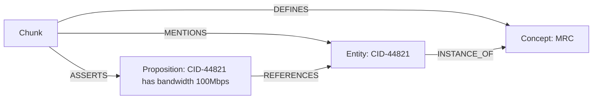
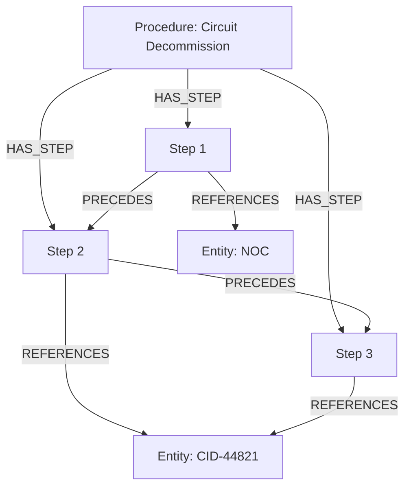
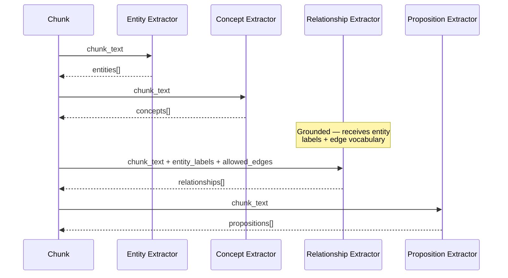

# Data Models Reference

All models are defined in `backend/models.py` using Pydantic v2.

## Model Hierarchy

```
models.py
├── Enums
│   ├── DocumentType       (pdf, text, csv, sop, ddl)
│   └── PipelineStage      (parse, chunk, extract, resolve, store, done, error)
│
├── Context Provider
│   └── ContextProvider     (provider_id, name, description, counts)
│
├── Ingestion
│   ├── IngestRequest       (provider_id, document_type, filename)
│   ├── ParseResult         (text, metadata, doc_type, docling_document)
│   ├── KnowledgeChunk      (chunk_id, text, char_start/end, embedding?)
│   └── PipelineEvent       (stage, message, detail?)
│
├── Extraction
│   ├── ExtractedNamedEntity    → Entity node in graph
│   ├── ExtractedConcept        → Concept node in graph
│   ├── ExtractedRelationship   → Edge in graph
│   ├── ExtractedProposition    → Proposition node in graph
│   ├── ExtractedProcedure      → Procedure node + DAG in graph + PS entry
│   │   └── ProcedureStep       → Step nodes in graph DAG
│   ├── ExtractedTableSemantic  → TableSchema node
│   │   └── ColumnSemantic
│   └── ExtractionResult        (container for all above)
│
├── Store Entries
│   ├── KnowledgeStoreEntry     → Milvus KS row
│   └── ProceduralStoreEntry    → Milvus PS row
│
└── Query
    ├── QueryRequest            (question, provider_id, top_k, graph_hops)
    ├── GraphNode               (node_id, label, properties, relevance?)
    ├── GraphEdge               (source, target, edge_type)
    ├── ReasoningSubgraph       (nodes, edges, anchor_node_ids)
    └── QueryResponse           (answer, reasoning_subgraph, graph_nodes, chunks_used, procedures)
```

## Extraction Models Explained

### Entity vs. Concept vs. Proposition

These three models capture different dimensions of knowledge from document text:

| Model | What it captures | Example | Graph node label |
|-------|-----------------|---------|-----------------|
| **ExtractedNamedEntity** | A concrete, named thing | `label: "CID-44821"`, `entity_type: "Circuit"` | `Entity` |
| **ExtractedConcept** | A reusable definition/idea (glossary entry) | `name: "Monthly Recurring Charge"`, `definition: "Fixed monthly fee"` | `Concept` |
| **ExtractedProposition** | A specific factual claim as (S, P, O) triple | `subject: "CID-44821"`, `predicate: "has bandwidth"`, `object: "100 Mbps"` | `Proposition` |



**Entity** = *what exists* (nouns)
**Concept** = *what it means* (definitions)
**Proposition** = *what is stated* (facts)

### SOP Procedure DAG

SOPs are NOT chunked. The full SOP text is passed to `ProcedureSignature` as a single unit. The resulting `ExtractedProcedure` creates a DAG in Neo4j:



Each `ProcedureStep` has `prerequisites: list[int]` for explicit dependency ordering. When no prerequisites are given, steps are chained sequentially via `PRECEDES` edges.

### Extraction Flow per Chunk



Note: SOP documents skip per-chunk extraction entirely. The full text goes to `ProcedureSignature` only.

## Edge Type Vocabulary (20 types)

| Edge | Source → Target | Meaning |
|------|----------------|---------|
| CONTAINS | Document → Chunk | Document contains this chunk |
| MENTIONS | Chunk → Entity | Chunk text mentions this entity |
| DEFINES | Chunk → Concept | Chunk defines this concept |
| ASSERTS | Chunk → Proposition | Chunk states this fact |
| RELATED_TO | Entity → Entity | General semantic relationship |
| INSTANCE_OF | Entity → Concept | Entity is an instance of concept |
| PART_OF | Entity → Entity | Physical/logical containment |
| GOVERNED_BY | Entity → Entity | Contractual/policy governance |
| CLASSIFIED_AS | Entity → Concept | Service/product classification |
| TERMINATES_AT | Entity → Entity | Circuit endpoint |
| PROVISIONED_FROM | Entity → Entity | Provisioned from a site/system |
| BILLED_ON | Entity → Entity | Billing reference |
| RECONCILES_TO | Entity → Entity | Invoice to contract reconciliation |
| FLAGS | Entity → Entity | Anomaly flags |
| DESCRIBED_BY | Entity → Chunk | Back-ref: entity to source chunk |
| IMPLEMENTED_BY | Concept → Procedure | Concept realised as procedure |
| PRECEDES | Step → Step | Step ordering within a procedure DAG |
| REFERENCES | Proposition/Step → Entity | Proposition or step references entity |
| SUPERSEDES | Entity → Entity | New record supersedes old |
| SOURCED_FROM | Chunk → Document | Chunk back-ref to parent doc |

Additionally, `HAS_STEP` (Procedure → Step) is created by `create_procedure_dag()` for the SOP DAG structure.

## Store Entry Models

### KnowledgeStoreEntry → Milvus KS

Each document chunk gets embedded and stored for semantic search. For SOPs, the full text is stored as a single KS entry.

| Field | Type | Notes |
|-------|------|-------|
| chunk_id | str | Primary key (uuid4) |
| provider_id | str | Provider namespace |
| source_file | str | Original filename |
| doc_type | str | Document type |
| text | str | Chunk text content |
| embedding | list[float] | 768-dim vector |
| char_start | int | Start position in source |
| char_end | int | End position in source |

### ProceduralStoreEntry → Milvus PS

Procedures extracted from SOP documents, embedded by their intent.

| Field | Type | Notes |
|-------|------|-------|
| procedure_id | str | Primary key (uuid4) |
| provider_id | str | Provider namespace |
| name | str | Procedure name |
| intent | str | One-line summary (embedded) |
| steps_json | str | JSON list of ProcedureStep |
| embedding | list[float] | 768-dim vector of intent |

## Query Models

### GraphEdge

Represents a directed edge in the reasoning subgraph.

| Field | Type | Notes |
|-------|------|-------|
| source | str | Source node_id |
| target | str | Target node_id |
| edge_type | str | Relationship type |

### ReasoningSubgraph

The exact nodes and edges that contributed to the answer, returned by the query engine.

| Field | Type | Notes |
|-------|------|-------|
| nodes | list[GraphNode] | All nodes in the subgraph |
| edges | list[GraphEdge] | All edges between those nodes |
| anchor_node_ids | list[str] | Entry points found via semantic search |

### QueryResponse

| Field | Type | Notes |
|-------|------|-------|
| answer | str | LLM-generated grounded answer |
| reasoning_subgraph | ReasoningSubgraph | Full path through the graph |
| graph_nodes | list[GraphNode] | Flat list (backwards compat) |
| chunks_used | list[str] | chunk_ids used in answer |
| procedures | list[str] | Procedure names retrieved |
| provider_id | str | Provider namespace |
