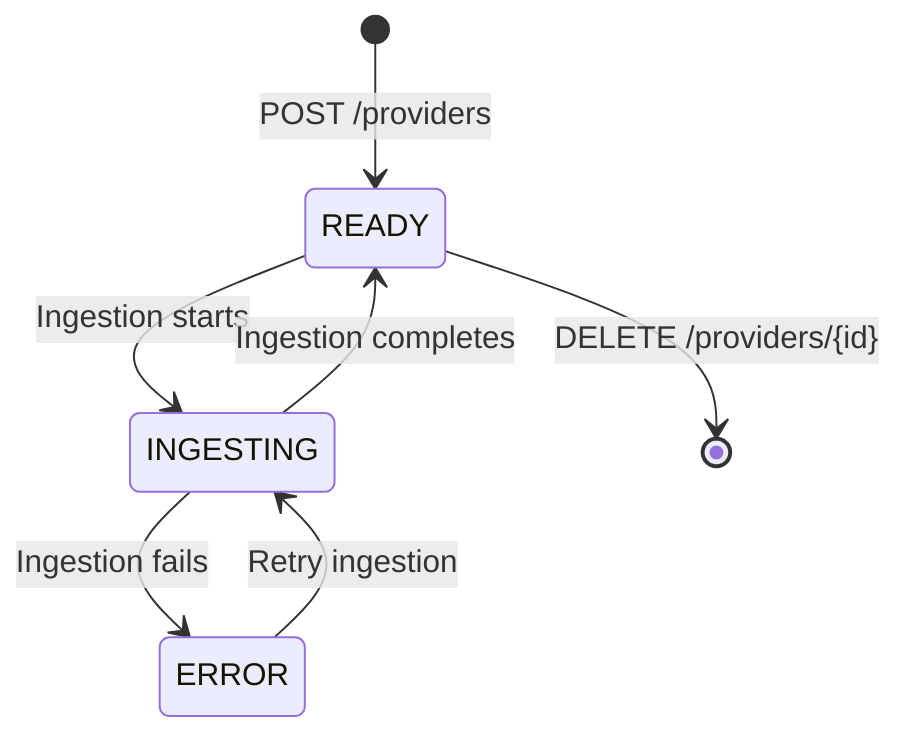
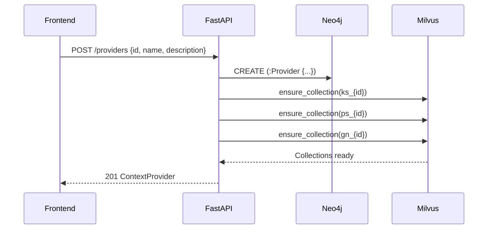
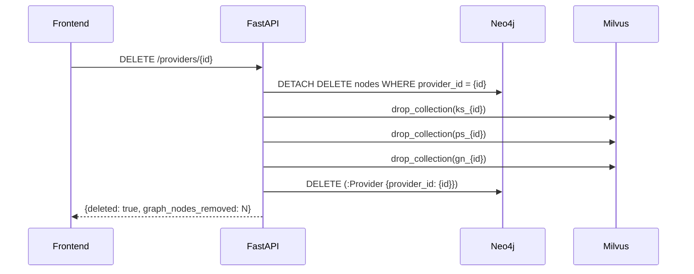
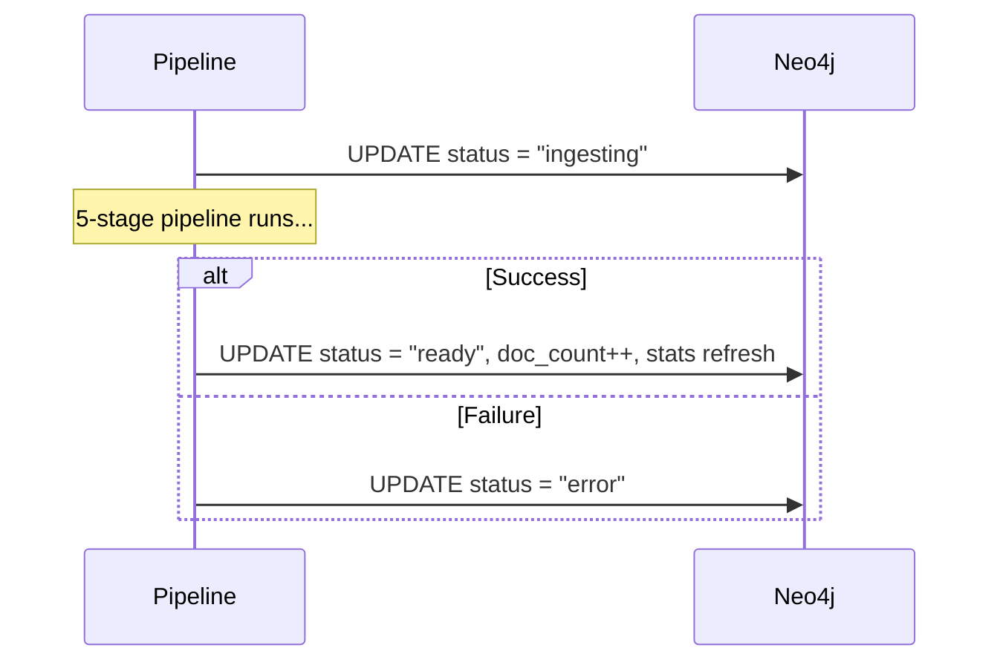

# Provider Management

Providers are the top-level organizational unit in Trident. Each provider represents an isolated context namespace — its own concept graph, knowledge store, procedural store, and graph node index.

## Provider Lifecycle



## Persistence

Providers are persisted as `(:Provider)` nodes in Neo4j. This ensures they survive backend restarts without requiring an additional database.

**Provider node properties:**

| Property | Type | Description |
|----------|------|-------------|
| `provider_id` | string | Unique slug identifier (e.g. `acme-telecom`) |
| `name` | string | Display name |
| `description` | string | What this provider context is about |
| `status` | enum | `ready`, `ingesting`, or `error` |
| `created_at` | ISO datetime | When the provider was created |
| `doc_count` | int | Number of documents ingested |
| `node_count` | int | Total graph nodes (entities, concepts, etc.) |
| `edge_count` | int | Total graph edges |
| `chunk_count` | int | Total text chunks stored |
| `last_ingested_at` | ISO datetime | When last ingestion completed |

## Eager Store Initialization

When a provider is created, all Milvus collections are eagerly initialized:



This guarantees that by the time a provider is returned, all backing stores are ready for immediate ingestion — no lazy initialization.

If Milvus collection creation fails, the Neo4j provider node is rolled back, ensuring no orphaned state.

## API Reference

### List Providers

```
GET /providers
```

Returns all providers ordered by creation date.

**Response:** `ContextProvider[]`

### Create Provider

```
POST /providers
```

**Request body:**

```json
{
  "provider_id": "acme-telecom",
  "name": "Acme Telecom",
  "description": "Circuit data, SOPs, and billing schemas"
}
```

**Response:** `201 ContextProvider`

Creates the provider node in Neo4j and eagerly initializes all three Milvus collections (`ks_`, `ps_`, `gn_`).

### Get Provider

```
GET /providers/{provider_id}
```

**Response:** `ContextProvider`

### Update Provider

```
PATCH /providers/{provider_id}
```

**Request body:**

```json
{
  "name": "New Name",
  "description": "Updated description"
}
```

Only provided fields are updated. **Response:** `ContextProvider`

### Delete Provider

```
DELETE /providers/{provider_id}
```

Cascading delete:
1. Drops all Milvus collections (`ks_`, `ps_`, `gn_`)
2. Deletes all Neo4j nodes with `provider_id` property (entities, concepts, chunks, etc.)
3. Deletes the Provider node itself



**Response:** `{ deleted: boolean, graph_nodes_removed: int }`

### Provider Stats

```
GET /providers/{provider_id}/stats
```

Returns live counts from the Neo4j graph.

**Response:**

```json
{
  "nodes": 156,
  "chunks": 24,
  "entities": 45,
  "concepts": 12,
  "propositions": 67,
  "procedures": 3
}
```

## Provider Isolation

All four stores enforce provider isolation:

| Store | Isolation Mechanism |
|-------|-------------------|
| **Neo4j** | Every node carries `provider_id` property; queries filter by it |
| **Knowledge Store** | Separate Milvus collection: `ks_{provider_id}` |
| **Procedural Store** | Separate Milvus collection: `ps_{provider_id}` |
| **Graph Node Index** | Separate Milvus collection: `gn_{provider_id}` |

## Ingestion Status Updates

During ingestion, the pipeline updates the provider status:



The frontend polls provider status and displays it as a badge on each provider card (`ready`, `ingesting`, `error`).
