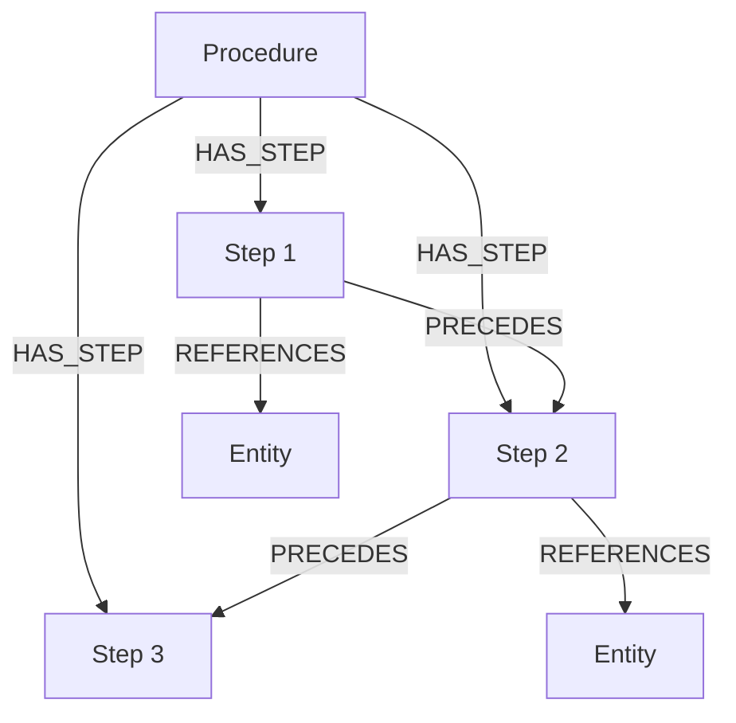
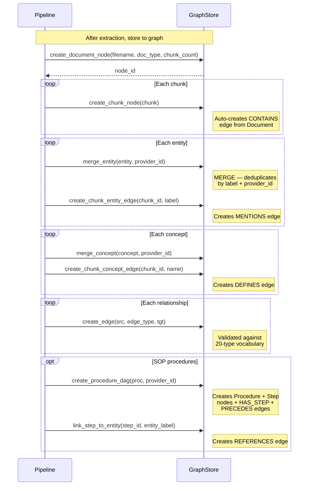
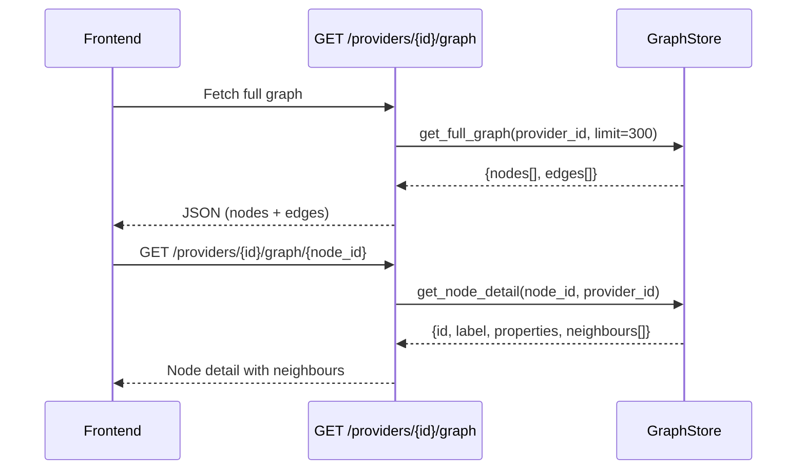
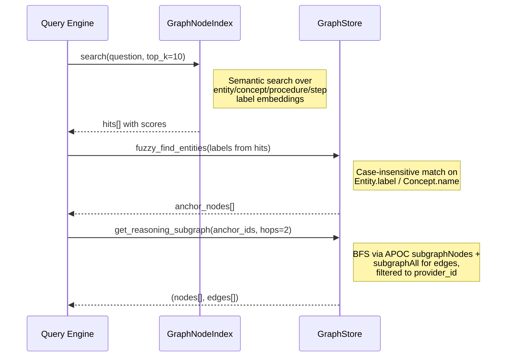
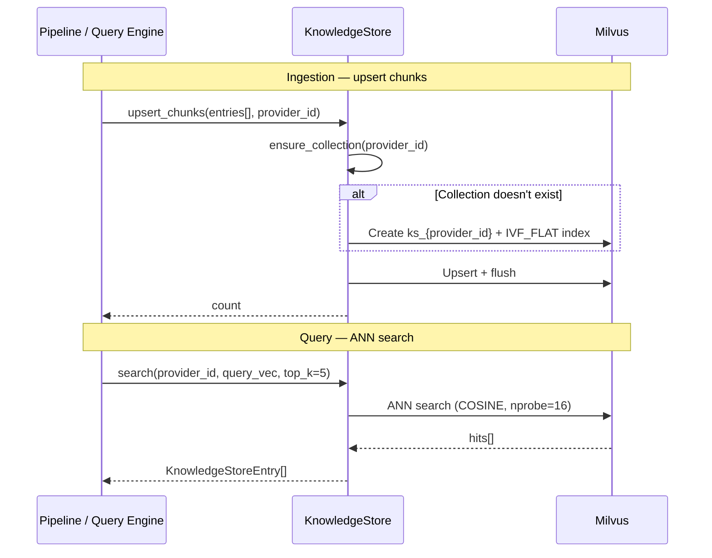
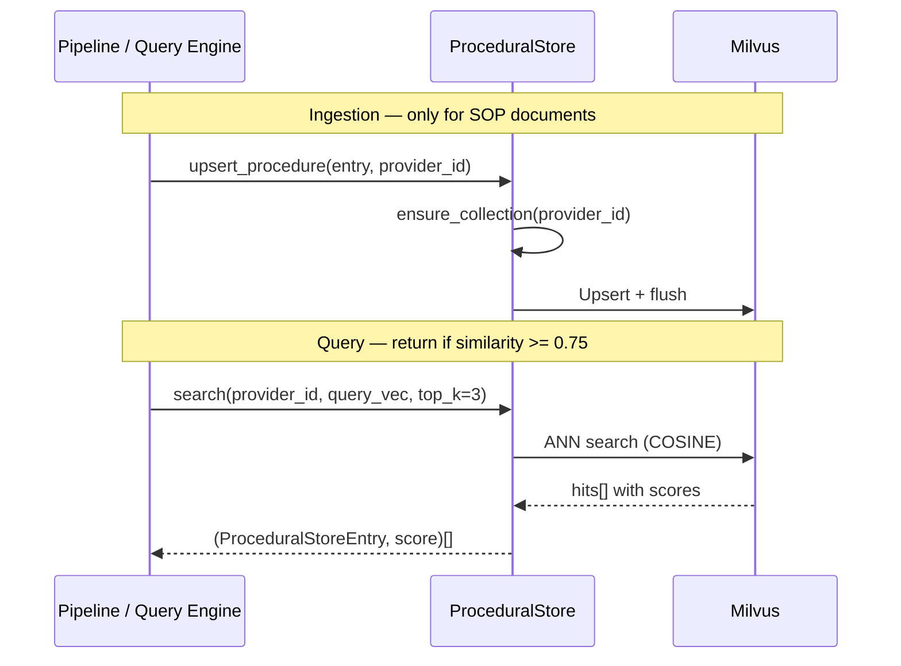
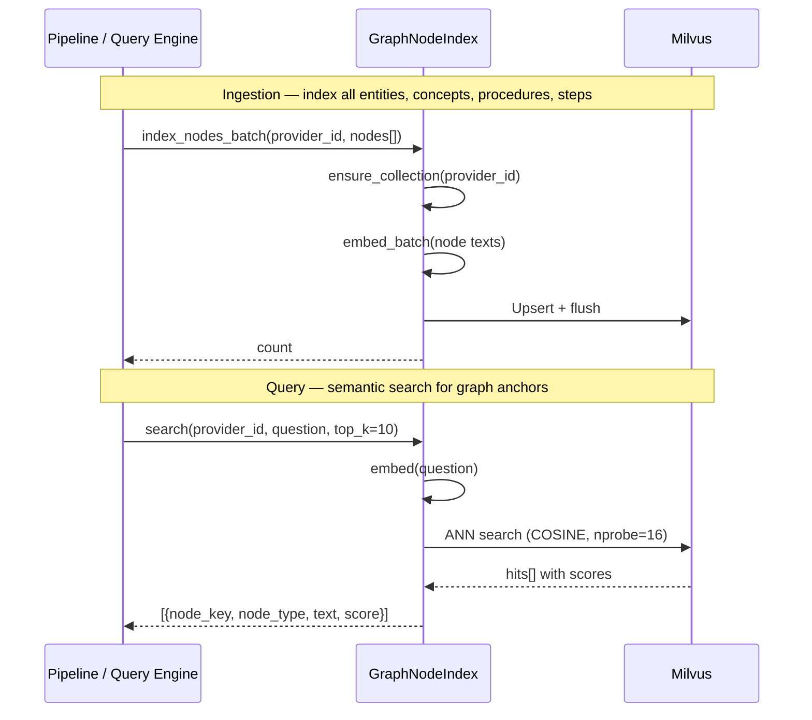
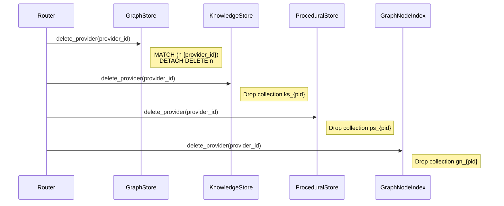

# Store Implementations

Trident uses four stores, each optimised for a different retrieval pattern. All stores are provider-scoped — no data leaks between providers.

## Store Architecture

```
┌───────────────────────────────────────────────────────────────────────────┐
│                         backend/stores/                                    │
│                                                                           │
│  graph.py          knowledge.py      procedural.py     graph_index.py    │
│  ┌──────────────┐  ┌──────────────┐  ┌─────────────┐  ┌──────────────┐  │
│  │  GraphStore   │  │KnowledgeStore│  │ProceduralSt.│  │GraphNodeIndex│  │
│  │  (Neo4j)     │  │  (Milvus)    │  │  (Milvus)   │  │  (Milvus)   │  │
│  │              │  │              │  │             │  │              │  │
│  │  Entities    │  │  ks_{pid}    │  │  ps_{pid}   │  │  gn_{pid}    │  │
│  │  Concepts    │  │  chunk vecs  │  │  proc vecs  │  │  node label  │  │
│  │  Propositions│  │              │  │             │  │  vecs        │  │
│  │  Procedures  │  │              │  │             │  │              │  │
│  │  Steps (DAG) │  │              │  │             │  │              │  │
│  │  Edges       │  │              │  │             │  │              │  │
│  └──────────────┘  └──────────────┘  └─────────────┘  └──────────────┘  │
└───────────────────────────────────────────────────────────────────────────┘
```

## 1. Concept Graph — `graph.py` (Neo4j)

Stores structured knowledge as nodes and edges. Supports graph traversal for query answering and full graph browsing for the explorer.

### Node Types

| Label | Key Properties | Created By |
|-------|---------------|------------|
| Document | filename, doc_type, chunk_count | Pipeline Stage 1 |
| Chunk | chunk_id, char_start, char_end, source_file | Pipeline Stage 2 |
| Entity | label, entity_type, description | NamedEntityExtractionModule |
| Concept | name, definition, aliases[] | ConceptExtractionModule |
| Proposition | subject, predicate, object, chunk_id | PropositionExtractionModule |
| Procedure | name, intent, steps_json | ProcedureExtractionModule |
| Step | step_number, description, responsible | create_procedure_dag() |
| TableSchema | table_name, description, columns_json | DBSemanticsModule |

All nodes carry `provider_id` for isolation.

### SOP Procedure DAG

SOPs create a DAG in Neo4j via `create_procedure_dag()`:



- `HAS_STEP`: Procedure → Step (always created)
- `PRECEDES`: Step → Step (from `prerequisites` list, or sequential fallback)
- `REFERENCES`: Step → Entity (entities extracted from each step's description, linked via `link_step_to_entity()`)

### Key Operations



### Graph Browsing (Explorer)



### Graph Traversal (Query Time)



### Edge Vocabulary

20 constrained edge types — the `create_edge()` method rejects any type not in this set:

```
ASSERTS, BILLED_ON, CLASSIFIED_AS, CONTAINS, DEFINES,
DESCRIBED_BY, FLAGS, GOVERNED_BY, IMPLEMENTED_BY, INSTANCE_OF,
MENTIONS, PART_OF, PRECEDES, PROVISIONED_FROM, RECONCILES_TO,
REFERENCES, RELATED_TO, SOURCED_FROM, SUPERSEDES, TERMINATES_AT
```

Additionally, `HAS_STEP` is used by `create_procedure_dag()` for Procedure → Step edges.

## 2. Knowledge Store — `knowledge.py` (Milvus)

Stores document chunk embeddings for semantic search. One collection per provider. For SOP documents, the full text is stored as a single entry.

### Collection Schema

Collection name: `ks_{provider_id}` (hyphens replaced with underscores)

| Field | Type | Notes |
|-------|------|-------|
| chunk_id | VARCHAR(64) | Primary key |
| provider_id | VARCHAR(128) | |
| source_file | VARCHAR(512) | |
| doc_type | VARCHAR(16) | |
| text | VARCHAR(8192) | Chunk content |
| embedding | FLOAT_VECTOR(768) | Indexed: IVF_FLAT, COSINE |
| char_start | INT64 | |
| char_end | INT64 | |

### Operations



## 3. Procedural Store — `procedural.py` (Milvus)

Stores procedure intents for SOP retrieval. Same pattern as KS but for procedures.

### Collection Schema

Collection name: `ps_{provider_id}`

| Field | Type | Notes |
|-------|------|-------|
| procedure_id | VARCHAR(64) | Primary key |
| provider_id | VARCHAR(128) | |
| name | VARCHAR(512) | |
| intent | VARCHAR(2048) | One-line summary |
| steps_json | VARCHAR(16384) | JSON list of ProcedureStep |
| embedding | FLOAT_VECTOR(768) | Indexed: IVF_FLAT, COSINE |

### Operations



## 4. Graph Node Index — `graph_index.py` (Milvus)

Embeds entity, concept, procedure, and step labels for semantic graph search. Used by the query engine to find anchor nodes without relying on string matching.

### Collection Schema

Collection name: `gn_{provider_id}` (hyphens replaced with underscores)

| Field | Type | Notes |
|-------|------|-------|
| node_key | VARCHAR(256) | Primary key (e.g. `entity:CID-44821`, `concept:MRC`, `step:Decom:1`) |
| node_type | VARCHAR(32) | `Entity`, `Concept`, `Procedure`, `Step` |
| text | VARCHAR(2048) | Label + description text used for embedding |
| embedding | FLOAT_VECTOR(768) | Indexed: IVF_FLAT, COSINE |

### Node Key Format

| Node Type | Key Pattern | Text Content |
|-----------|-------------|-------------|
| Entity | `entity:{label}` | `{label}: {description}` |
| Concept | `concept:{name}` | `{name}: {definition}` |
| Procedure | `procedure:{name}` | `{name}: {intent}` |
| Step | `step:{proc_name}:{step_number}` | `{step.description}` |

### Operations



## Provider Lifecycle

When a provider is deleted, all four stores are cleaned:


